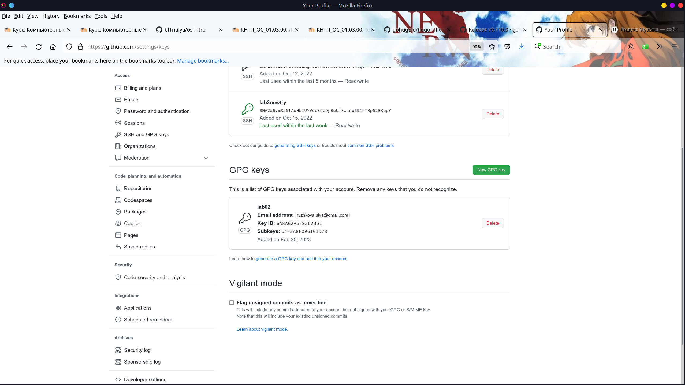
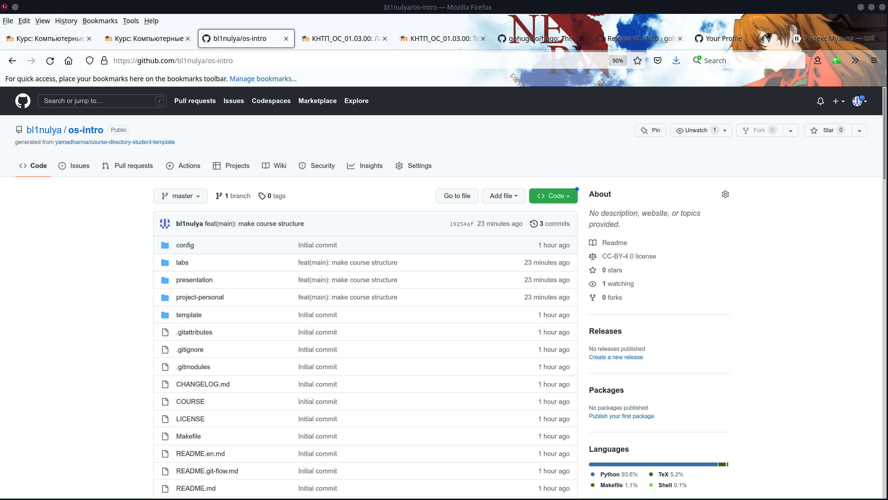
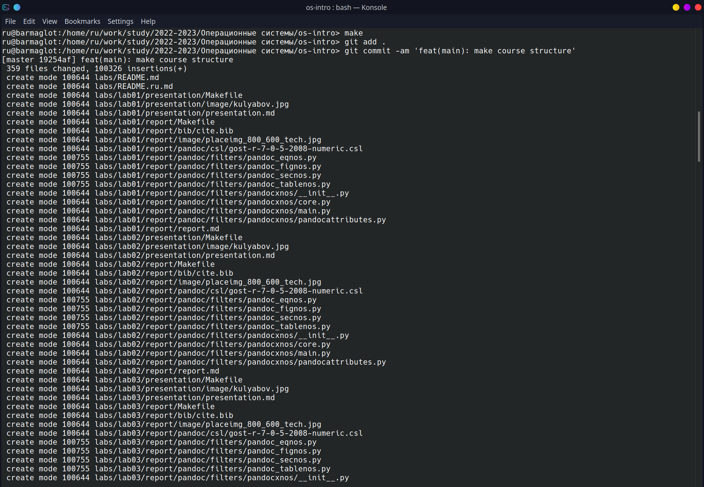

---
## Front matter
lang: ru-RU
title: Научная презентация
subtitle: Лабораторная №3
author:
  - Рыжкова У. В.
institute:
  - Российский университет дружбы народов, Москва, Россия
date: 25 февраля 2023

## i18n babel
babel-lang: russian
babel-otherlangs: english

## Formatting pdf
toc: false
toc-title: Содержание
slide_level: 2
aspectratio: 169
section-titles: true
theme: metropolis
header-includes:
 - \metroset{progressbar=frametitle,sectionpage=progressbar,numbering=fraction}
 - '\makeatletter'
 - '\beamer@ignorenonframefalse'
 - '\makeatother'
---

# Информация

## Докладчик

:::::::::::::: {.columns align=center}
::: {.column width="70%"}

  * Рыжкова Ульяна Валерьевна
  * студент 1-ого курса
  * профессор кафедры прикладной информатики и теории вероятностей
  * Российский университет дружбы народов
  * [1132226462@pfur.ru](mailto:1132226462@pfur.ru)
  * <https://bl1nulya.github.io/ru/>

# Выполнение лабораторной работы

1. Заданием является составить отчёт предыдущей лабораторной работы. Увы, я делала её с опозданием и совершенно забыла о скриншотах (надеюсь, скринкаст с комментариями решит этот недочёт)

2. Поскольку я уже являюсь пользователем github и в прошлом семестре настроила систему git, перехожу к шагу создания pgp ключа. 

{#fig:001 width=100%}

3. Настроила подпись коммитов.

4. С помощью шаблона создаю репозиторий для проходимого в этом семестре курса.

{#fig:002 width=100%}

5. Удаляю лишние файлы и создаю необходимые каталоги с помощью команды make. Отправляю файлы на сервер.

{#fig:003 width=100%}

# Выводы

Я ознакомилась с языком разметки Markdown.
