---
## Front matter
lang: ru-RU
title: Презентация по лабораторной работе №7
subtitle: Операционные системы
author:
  - Рыжкова Ульяна Валерьевна
institute:
  - Российский университет дружбы народов, Москва, Россия
date: 25 марта 2023

## i18n babel
babel-lang: russian
babel-otherlangs: english

## Formatting pdf
font: PT Serif
toc: false
toc-title: Содержание
slide_level: 2
aspectratio: 169
section-titles: true
theme: metropolis
header-includes:
 - \metroset{progressbar=frametitle,sectionpage=progressbar,numbering=fraction}
 - '\makeatletter'
 - '\beamer@ignorenonframefalse'
 - '\makeatother'
---

# Докладчик

  * Рыжкова Ульяна Валерьевна
  * студент
  * Российский университет дружбы народов
  * [1132226462@pfur.ru](mailto:1132226462@pfur.ru)

# Выполнение

1. Изучаем информацию о mc с помощью команды man mc (рис. @fig:001).

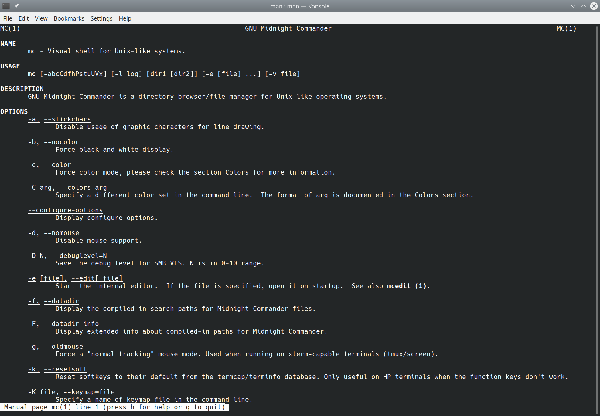{#fig:001 width=100%}

# Выполнение

2. Запускаем mc с помощью команды mc (рис. @fig:002)

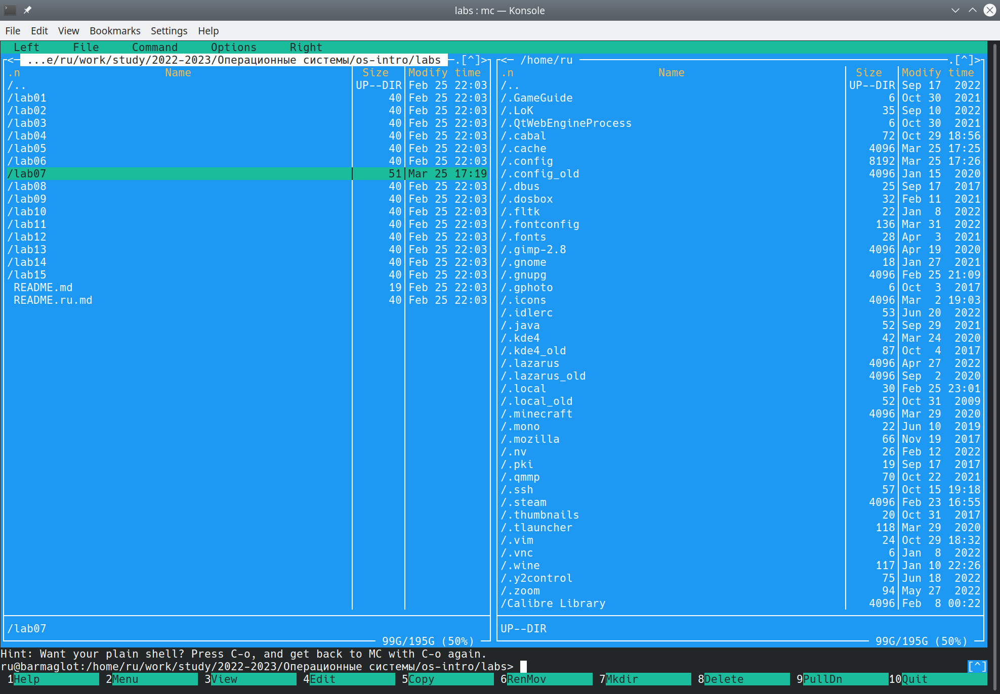{#fig:002 width=100%}

# Выполнение

3. Изучаем операции с панелями (рис. @fig:003)

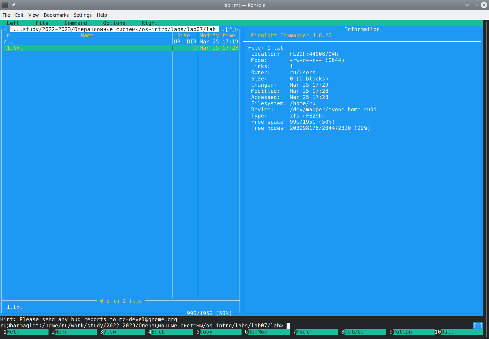{#fig:003 width=100%}

# Выполнение

4. Копирование и перемещение файлов с помощью горячих клавиш f5 и f6 соответственно (рис. @fig:004, рис. @fig:005)

{#fig:004 width=100%}

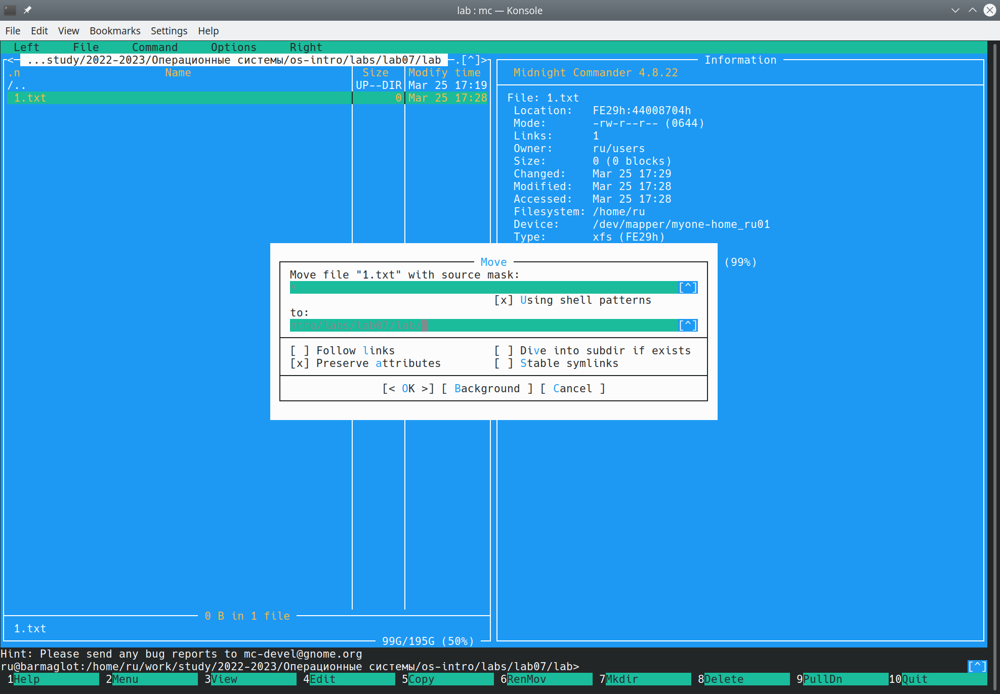{#fig:005 width=100%}

# Выполнение

5. Создание нового каталога с помощью горячей клавиши f7 (рис. @fig:006)

{#fig:006 width=100%}

# Выполнение

6. Поиск файла с помощью подменю Команда (рис. @fig:007)

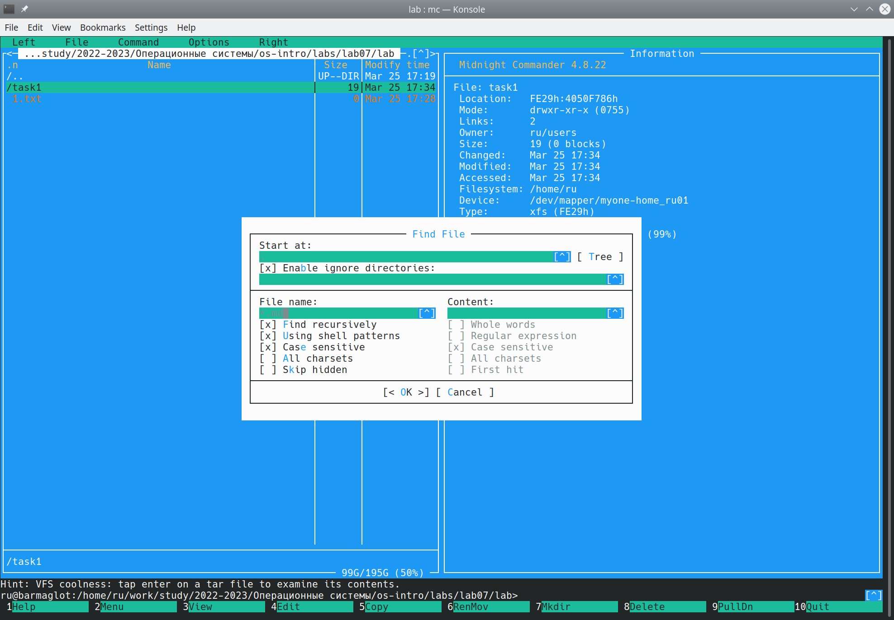{#fig:007 width=100%}

# Выполнение

7. Смотрим историю команд и вызываем одну из предыдущих (в данном случае touch lab6-1.asm, файл создан) (рис. @fig:008)

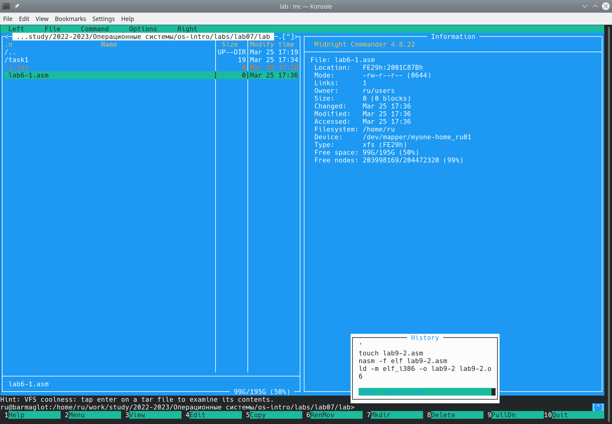{#fig:008 width=100%}

# Выполнение

8. Создаем команду быстрого перехода в домашний каталог и переходим в него (рис. @fig:009, рис. @fig:010)

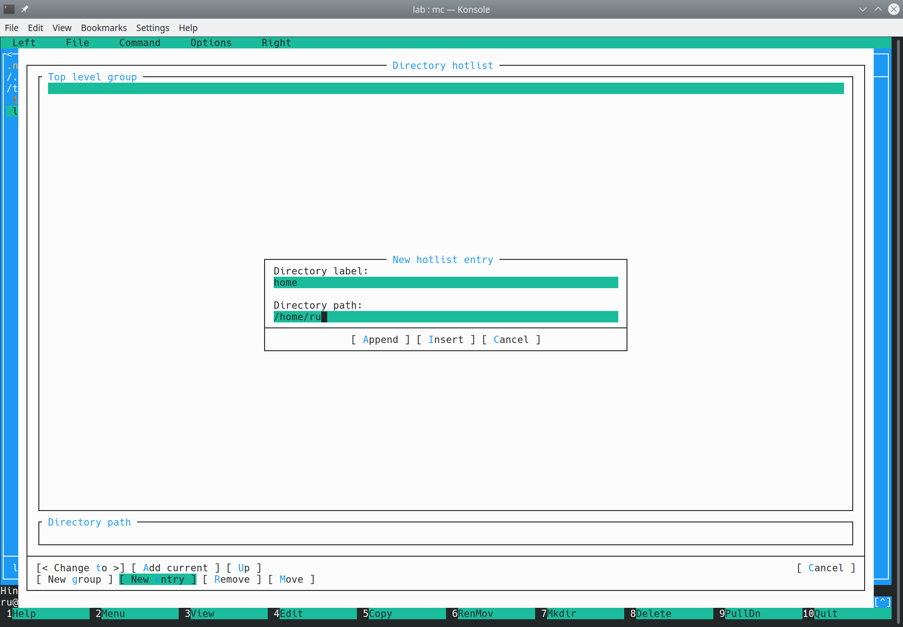{#fig:009 width=100%}

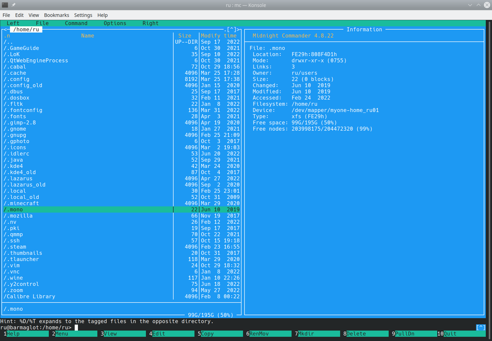{#fig:010 width=100%}

# Выполнение

9. Создаем файл text.txt (рис. @fig:011)

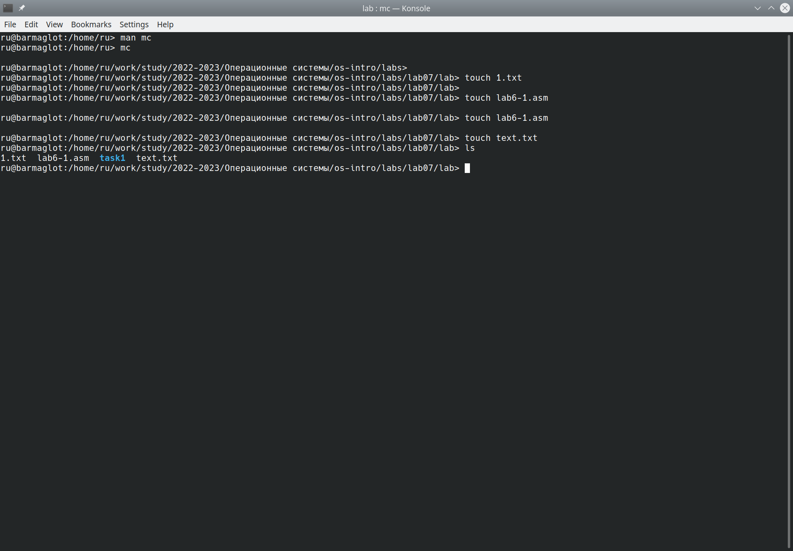{#fig:011 width=100%}

# Выполнение

10. Вставляем текст в файл и проводим следующие манипуляции: удаление строки текста с помощью команды ctrl+y; выделение текста с помощью клавиши f3 и последующие копирование (клавиша f5) и перемещение (клавиша f6); сохранение с помощью клавиши f2; отмена предыдущего действия с помощью ctrl+u; перемещение в конец (ctrl+end, end) и начало (ctrl+home, home) файла; выход - f10 (рис. @fig:012)

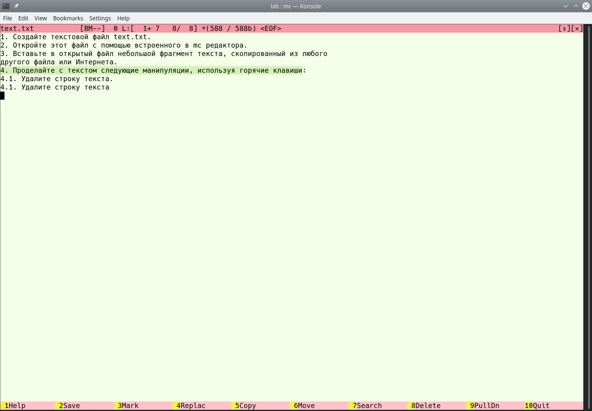{#fig:012 width=100%}

# Выполнение

11. Подсветка синтаксиса: f4 -> f9 -> options -> syntax highlighting (рис. @fig:014)

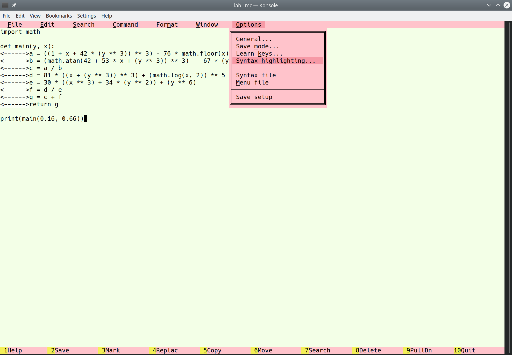{#fig:014 width=100%}

# Выводы

Я освоила базовый функционал mc
