---
## Front matter
title: "Отчёт по лабораторной работе №7"
subtitle: "Дисциплина: Операционные системы"
author: "Рыжкова Ульяна Валерьевна"

## Generic otions
lang: ru-RU
toc-title: "Содержание"

## Bibliography
bibliography: bib/cite.bib
csl: pandoc/csl/gost-r-7-0-5-2008-numeric.csl

## Pdf output format
toc: true # Table of contents
toc-depth: 2
lof: true # List of figures
lot: true # List of tables
fontsize: 12pt
linestretch: 1.5
papersize: a4
documentclass: scrreprt
## I18n polyglossia
polyglossia-lang:
  name: russian
  options:
	- spelling=modern
	- babelshorthands=true
polyglossia-otherlangs:
  name: english
## I18n babel
babel-lang: russian
babel-otherlangs: english
## Fonts
mainfont: PT Serif
romanfont: PT Serif
sansfont: PT Sans
monofont: PT Mono
mainfontoptions: Ligatures=TeX
romanfontoptions: Ligatures=TeX
sansfontoptions: Ligatures=TeX,Scale=MatchLowercase
monofontoptions: Scale=MatchLowercase,Scale=0.9
## Biblatex
biblatex: true
biblio-style: "gost-numeric"
biblatexoptions:
  - parentracker=true
  - backend=biber
  - hyperref=auto
  - language=auto
  - autolang=other*
  - citestyle=gost-numeric
## Pandoc-crossref LaTeX customization
figureTitle: "Рис."
tableTitle: "Таблица"
listingTitle: "Листинг"
lofTitle: "Список иллюстраций"
lotTitle: "Список таблиц"
lolTitle: "Листинги"
## Misc options
indent: true
header-includes:
  - \usepackage{indentfirst}
  - \usepackage{float} # keep figures where there are in the text
  - \floatplacement{figure}{H} # keep figures where there are in the text
---

# Цель работы

Ознакомиться с командной оболочкой Midnight Commander

# Выполнение лабораторной работы

1. Изучаем информацию о mc с помощью команды man mc (рис. @fig:001).

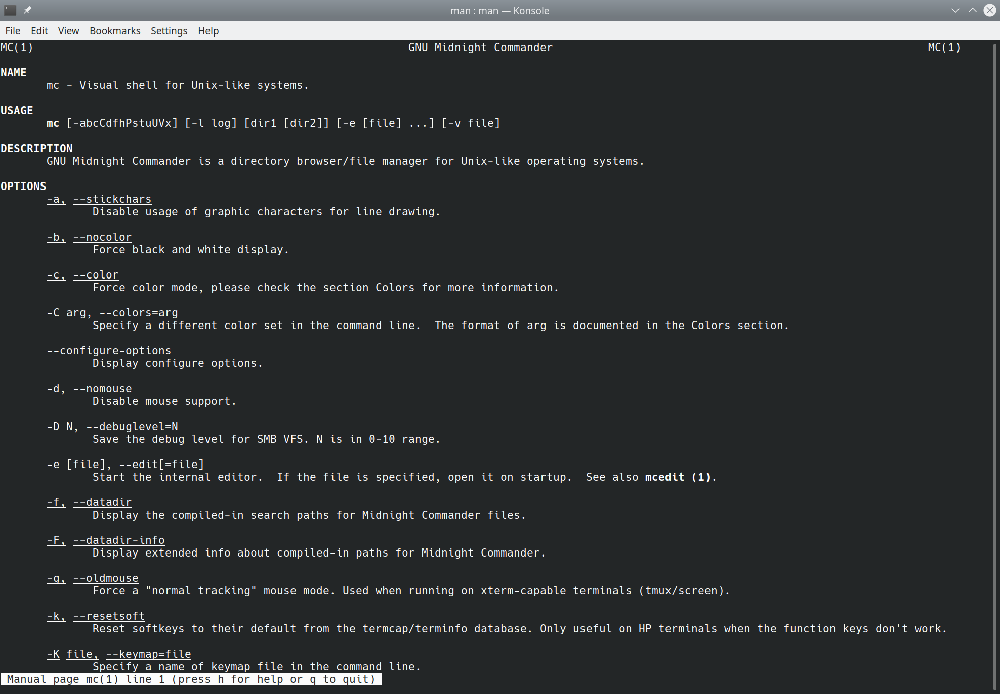{#fig:001 width=100%}

2. Запускаем mc с помощью команды mc (рис. @fig:002)

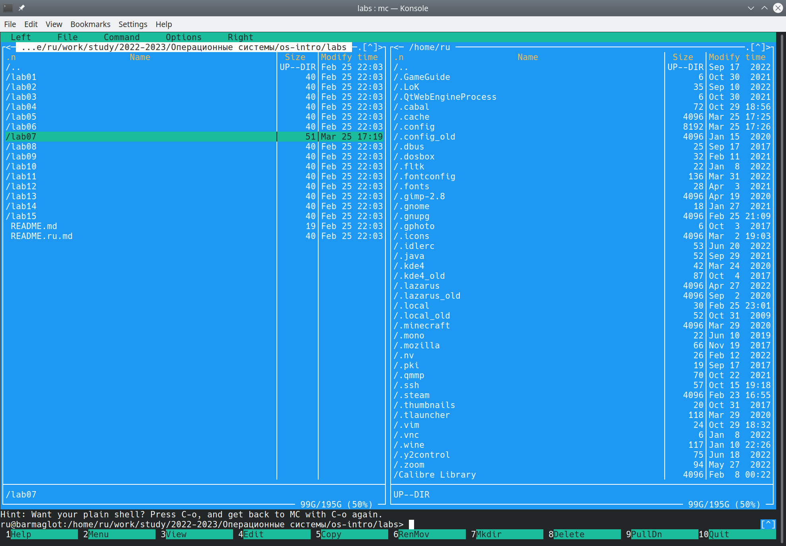{#fig:002 width=100%}

3. Изучаем операции с панелями (рис. @fig:003)

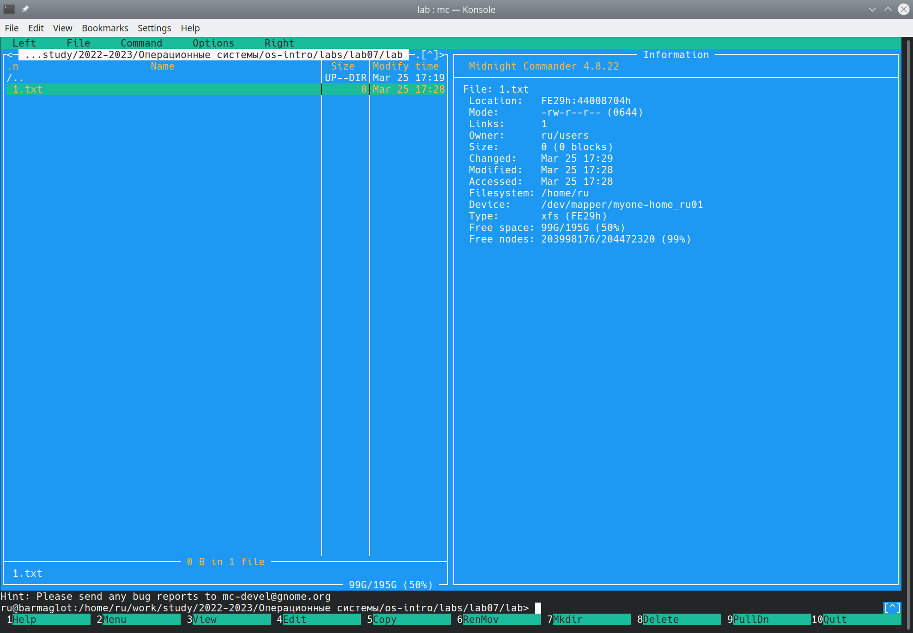{#fig:003 width=100%}

4. Копирование и перемещение файлов с помощью горячих клавиш f5 и f6 соответственно (рис. @fig:004, рис. @fig:005)

{#fig:004 width=100%}

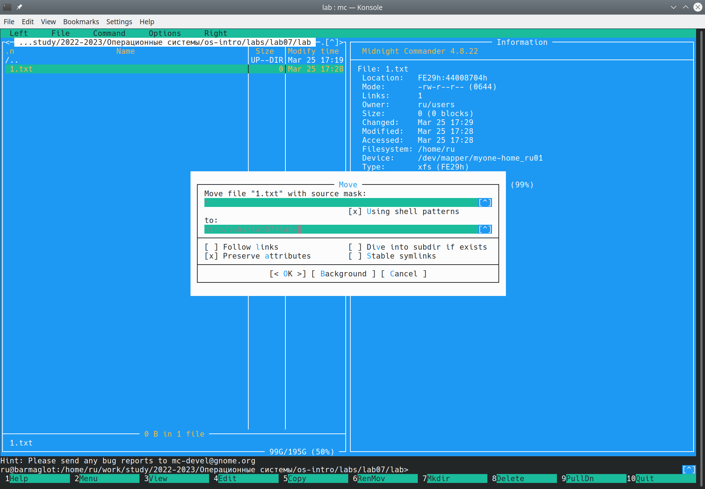{#fig:005 width=100%}

5. Создание нового каталога с помощью горячей клавиши f7 (рис. @fig:006)

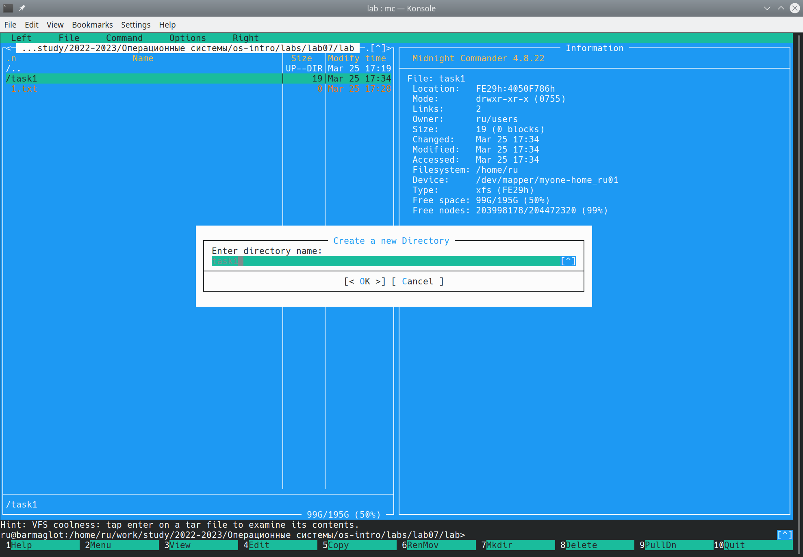{#fig:006 width=100%}

6. Поиск файла с помощью подменю Команда (рис. @fig:007)

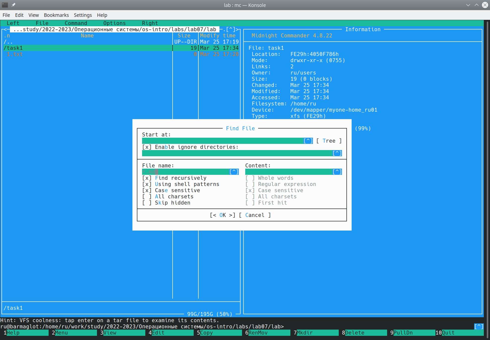{#fig:007 width=100%}

7. Смотрим историю команд и вызываем одну из предыдущих (в данном случае touch lab6-1.asm, файл создан) (рис. @fig:008)

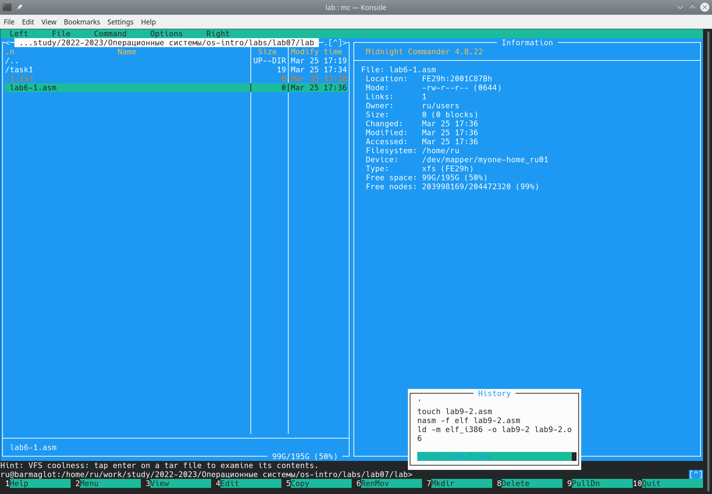{#fig:008 width=100%}

8. Создаем команду быстрого перехода в домашний каталог и переходим в него (рис. @fig:009, рис. @fig:010)

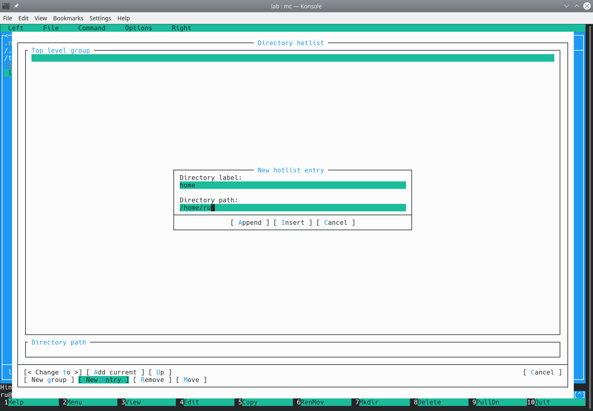{#fig:009 width=100%}

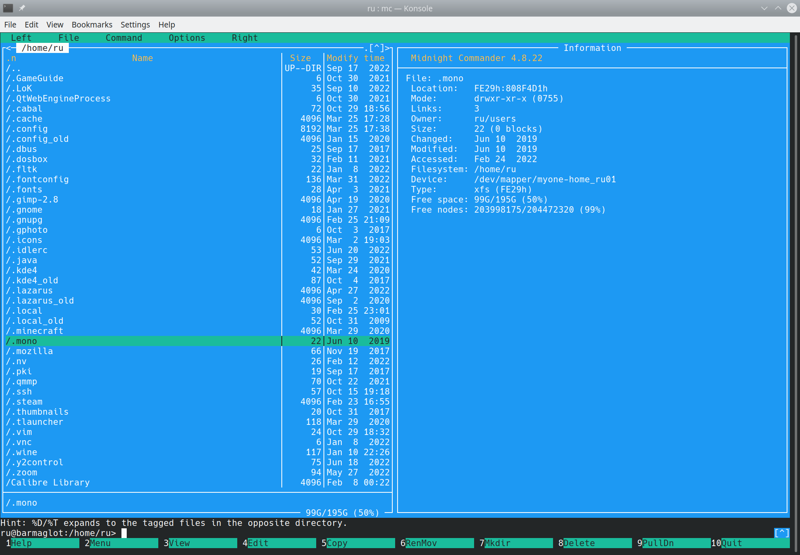{#fig:010 width=100%}

9. Создаем файл text.txt (рис. @fig:011)

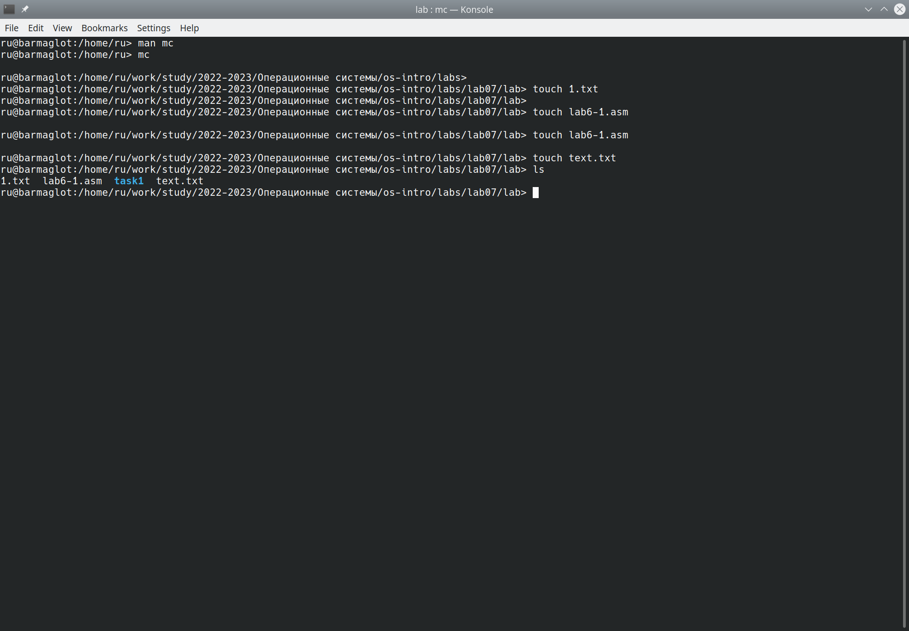{#fig:011 width=100%}

10. Вставляем текст в файл и проводим следующие манипуляции: удаление строки текста с помощью команды ctrl+y; выделение текста с помощью клавиши f3 и последующие копирование (клавиша f5) и перемещение (клавиша f6); сохранение с помощью клавиши f2; отмена предыдущего действия с помощью ctrl+u; перемещение в конец (ctrl+end, end) и начало (ctrl+home, home) файла; выход - f10 (рис. @fig:012)

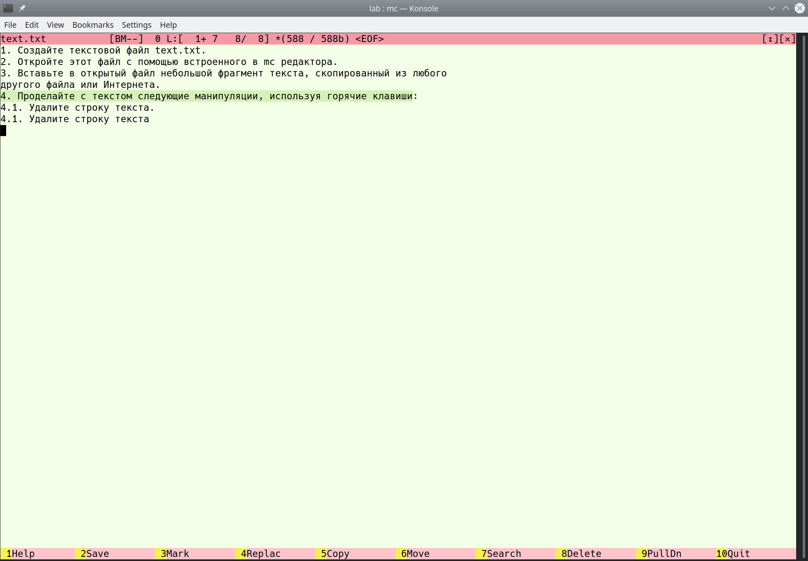{#fig:012 width=100%}

11. Подсветка синтаксиса: f4 -> f9 -> options -> syntax highlighting (рис. @fig:014)

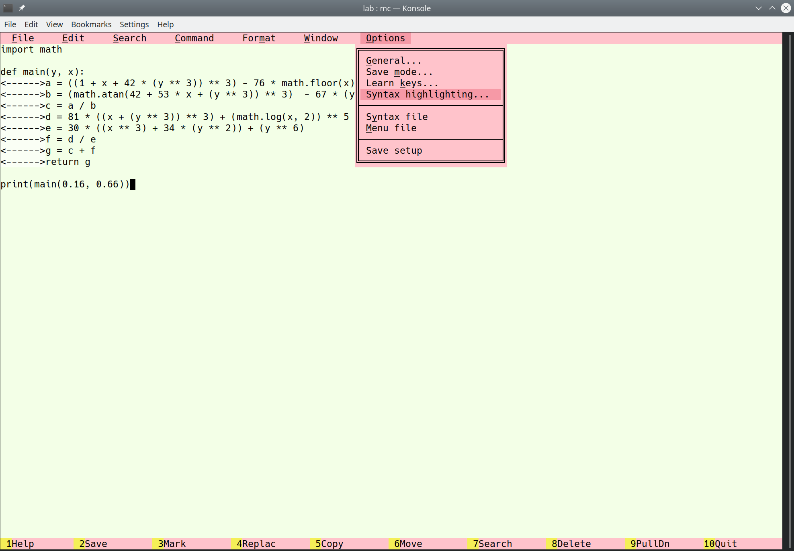{#fig:014 width=100%}

# Контрольные вопросы

1. Режимы работы mc:

    * Режим "Информация": на панель выводится информация о выделенном файле/каталоге
    * Режим "Дерево": на панель выводится каталог в структуре дерева

2. Примеры операций с файлами в mc: копирование, перемещение, поиск, сортировка

3. Структура меню панелей:

    * Список файлов показывает файлы в каталоге
    * Быстрый просмотр - быстрый просмотр содержимого панели
    * Информация позволяет посмотреть информацию о файле/каталоге
    * Порядок сортировки задает критерии сортировке при отображении списка файлов
    
4. Структура меню файл: 

    * Просмотр содержимого без редактирования f3
    * Вывод файлов с учётом введенных параметров M-!
    * Правка содержимого f4
    * Копирование f5
    * Просмотр и изменение прав доступа C-x, c
    * Создание жесткой ссылки C-x, l
    * Создание символической ссылки C-x, v
    * Владелец группы: изменение владельца и имени группы для файлов/каталогов ctrl-x, o
    * Перемещение f6
    * Создание нового каталога f7
    * Удаление файла/каталога f8
    * Быстрый просмотр M-c
    * Выход f10
    
5. Структура меню Команда:
    
    * Поиск файла по заданным параметрам M-?
    * Перестановка панелей ctrl-u
    * Включить/выключить отображение панелей ctrl-o
    * Сравнение содержимого двух каталогов ctrl-x d
    * Сравнение двух файлов ctrl-x ctrl-d
    * Размер и время изменения каталогов ctrl-space
    * История предыдущих команд M-h
    * Редактирование файла расширений: задаёт действия при запуске файлов с определённым расширением
    * Редактирование файла меню: изменяет контекстное меню пользователя, вызываемое с помощью горячей клавиши f2
    * Редактирование файла расцветки имён: подбор оптимальной расцветки имён файлов в зависимости от их типа
    
6. Структура меню Настройки:

    * Конфигурация позволяет скорректировать насройки работы с панелями
    * Внешний вид и Настройки панелей определяют элементы, отображаемые при вызове mc
    * Биты символов задаёт формат обработки информации локальным терминалом
    * Подтверждение устанавливает или убирает вывод окна с запросом подтверждения действий при различных операциях (например удаление или выход)
    * Виртуальные ФС настройки виртуальной файловой системы

7. Встроенные команды mc: 

    * f1 - вызов подсказки
    * f2 - вызов пользовательского меню
    * f3 - просмотр содержимого файла без редактирования
    * f4 - правка файла
    * f5 - копирование файла/каталога
    * f6 - перемещение/переименование файла/каталога
    * f7 - создание нового каталога
    * f8 - удаление файла/каталога
    * f9 - вызов меню mc
    * f10 - выход

8. Команды встроенного редактора mc:

    * ctrl-y - удаление строки
    * ctrl-u - отмена последней команды
    * ins - вставка
    * shift+f7 - повтор последней операции поиска
    * f7 - поиск
    * f2 - сохранение изменений
    * f3 - выделение (первое нажатие - начало, второе - конец)
    * f4 - замена файла
    * f5 - копирование файла/каталога
    * f6 - перемещение/переименование файла/каталога
    * f8 - удаление
    * f10 - выход из редактора

9. Средства mc, позволяющие создать меню, определяемые пользователем: В mc существуют пользовательские списки, то есть определенные самим пользователем. Это позволяет редактировать меню. Меню пользователя - меню, состоящее из команд, определенных пользователем. При вызове меню используется файл ~/.mc/menu. Все строки в этих файах являются командами, которые выполняются при выборе записи.

10. Средства mc, позволяющие выполнять действия, определяемые пользователем, над текущим файлом: обработка файлов происходит в соответствии с системными файлами (например, файл помощи для mc: /usr/lib/mc.hlp; существует много других файлов)

# Выводы

Я освоила основной функционал Midnight Commander
