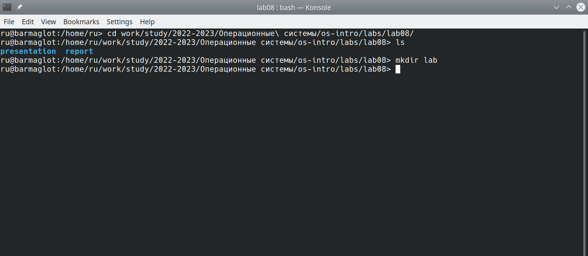

---
## Front matter
\lang: ru-RU
title: Презентация по лабораторной работе №8
subtitle: Операционные системы
author:
  - Рыжкова У. В.
institute:
  - Российский университет дружбы народов, Москва, Россия
date: 01 апреля 2023

## i18n babel
\babel-lang: russian
\babel-otherlangs: english

## Fonts
mainfont: PT Serif
romanfont: PT Serif
sansfont: PT Sans
monofont: PT Mono

## Formatting pdf
\toc: false
\toc-title: Содержание
\slide_level: 2
\aspectratio: 169
\section-titles: true
\theme: metropolis
\header-includes:
 - \metroset{progressbar=frametitle,sectionpage=progressbar,numbering=fraction}
 - '\makeatletter'
 - '\beamer@ignorenonframefalse'
 - '\makeatother'
---

## Информация
Докладчик

  * Рыжкова Ульяна Валерьевна
  * студент
  * Российский университет дружбы народов

# Задание 1. Создание нового файла с использованием vi

## 
1. Создаём каталог и переходим в него

{#fig:001 width=100%}

## 
2. Создаём файл с помощью команды vi hello.sh

{#fig:002 width=100%}

## 

3. Вводим текст, и с помощью комбинации :wq сохраняем изменения и выходим из редактора

{#fig:003 width=100%}

## 

4. Делаем файл исполняемым

{#fig:004 width=100%}

# Задание 2. Редактирование существующего файла

1. Вызвав vi на редактирование файла, устанавливаем курсор в конец слова HELL 2-ой строки, используя комбинацию 2G и 5 пробелов

## 

2. Переходим в режим вставки, нажав i, добавляем букву O, и, нажав esc, возвращаемся в командный режим

{#fig:005 width=100%}

## 

3. Переходим в 4-ую строку (комбинация 4G) и стираем слово LOCAL (комбинация dw)

{#fig:006 width=100%}

## 

4. Переходим в режим вставки (i), вводим слово 'local', и возвращаемся в командный режим (esc)

{#fig:007 width=100%}

## 

5. Перемещаемся в последнюю строку (G), вставляем пустую строку (о) и вводим текст

## 

6. Удаляем последнюю строку с помощью комбинации dd. Отменяем последнее действие клавишей u

## 

7. Вводим :wq, чтобы сохранить изменения и выйти из файла.
