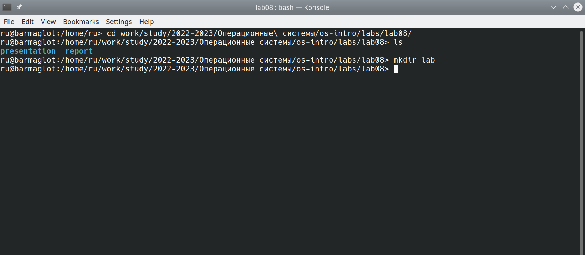
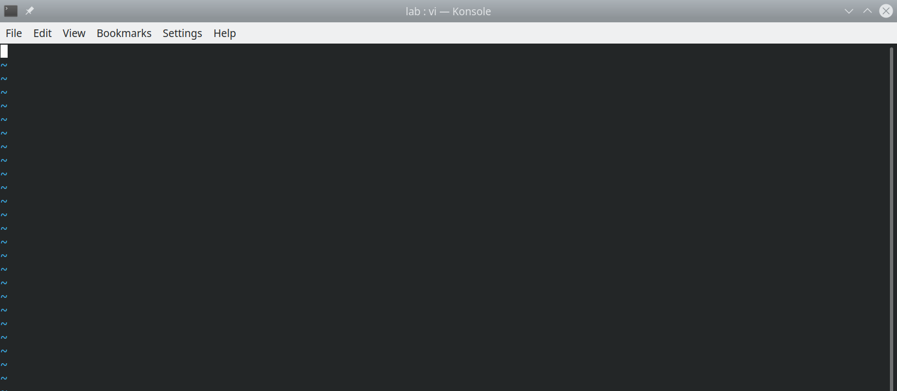
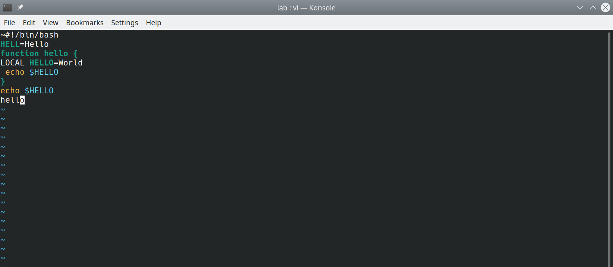
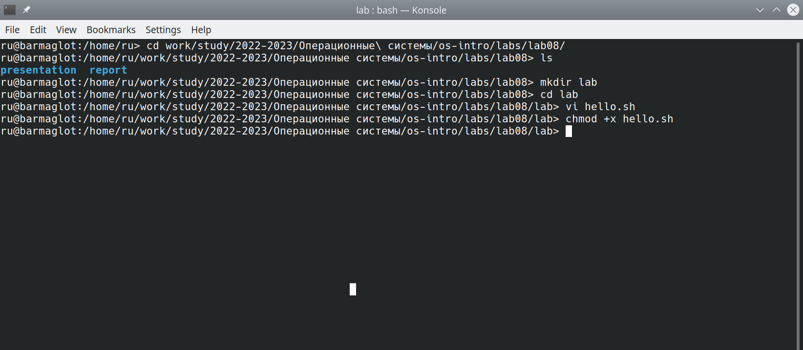
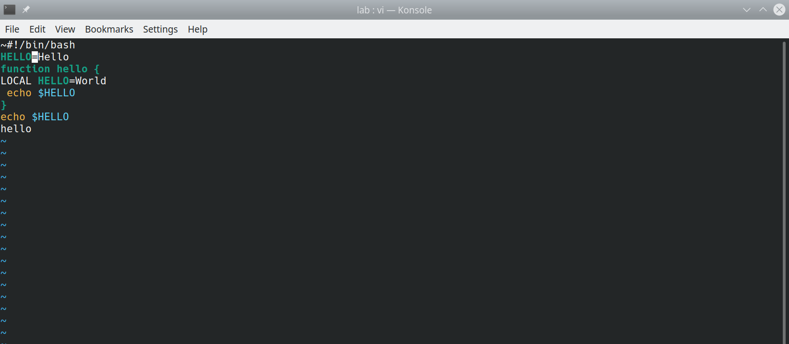
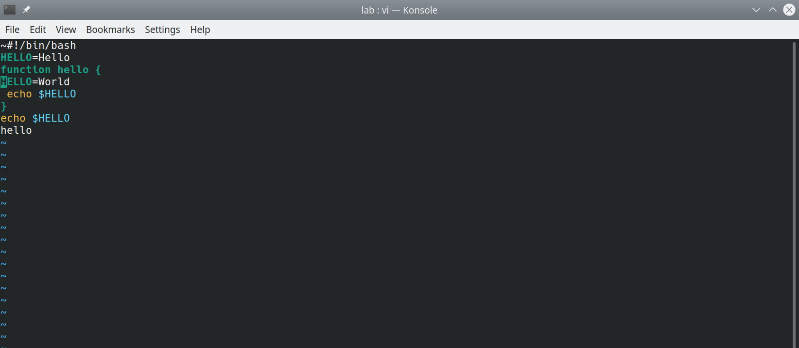
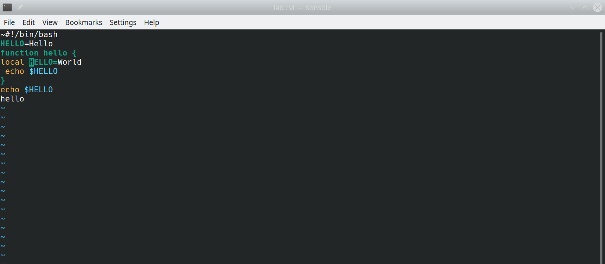

---
## Front matter
title: "Отчёт по лабораторной работе №8"
subtitle: "Дисциплина: Операционные системы"
author: "Рыжкова Ульяна Валерьевна"

## Generic otions
lang: ru-RU
toc-title: "Содержание"

## Bibliography
bibliography: bib/cite.bib
csl: pandoc/csl/gost-r-7-0-5-2008-numeric.csl

## Pdf output format
toc: true # Table of contents
toc-depth: 2
lof: true # List of figures
lot: true # List of tables
fontsize: 12pt
linestretch: 1.5
papersize: a4
documentclass: scrreprt
## I18n polyglossia
polyglossia-lang:
  name: russian
  options:
	- spelling=modern
	- babelshorthands=true
polyglossia-otherlangs:
  name: english
## I18n babel
babel-lang: russian
babel-otherlangs: english
## Fonts
mainfont: PT Serif
romanfont: PT Serif
sansfont: PT Sans
monofont: PT Mono
mainfontoptions: Ligatures=TeX
romanfontoptions: Ligatures=TeX
sansfontoptions: Ligatures=TeX,Scale=MatchLowercase
monofontoptions: Scale=MatchLowercase,Scale=0.9
## Biblatex
biblatex: true
biblio-style: "gost-numeric"
biblatexoptions:
  - parentracker=true
  - backend=biber
  - hyperref=auto
  - language=auto
  - autolang=other*
  - citestyle=gost-numeric
## Pandoc-crossref LaTeX customization
figureTitle: "Рис."
tableTitle: "Таблица"
listingTitle: "Листинг"
lofTitle: "Список иллюстраций"
lotTitle: "Список таблиц"
lolTitle: "Листинги"
## Misc options
indent: true
header-includes:
  - \usepackage{indentfirst}
  - \usepackage{float} # keep figures where there are in the text
  - \floatplacement{figure}{H} # keep figures where there are in the text
---

# Цель работы

Ознакомиться с текстовым редактором vi и получить практические навыки работы с ним

# Задание 1. Создание нового файла с использованием vi

1. Создаём каталог и переходим в него

{#fig:001 width=100%}

2. Создаём файл с помощью команды vi hello.sh

{#fig:002 width=100%}

3. Вводим текст, и с помощью комбинации :wq сохраняем изменения и выходим из редактора

{#fig:003 width=100%}

4. Делаем файл исполняемым

{#fig:004 width=100%}

# Задание 2. Редактирование существующего файла

1. Вызвав vi на редактирование файла, устанавливаем курсор в конец слова HELL 2-ой строки, используя комбинацию 2G и 5 пробелов

2. Переходим в режим вставки, нажав i, добавляем букву O, и, нажав esc, возвращаемся в командный режим

{#fig:005 width=100%}

3. Переходим в 4-ую строку (комбинация 4G) и стираем слово LOCAL (комбинация dw)

{#fig:006 width=100%}

4. Переходим в режим вставки (i), вводим слово 'local', и возвращаемся в командный режим (esc)

{#fig:007 width=100%}

5. Перемещаемся в последнюю строку (G), вставляем пустую строку (о) и вводим текст

6. Удаляем последнюю строку с помощью комбинации dd. Отменяем последнее действие клавишей u

7. Вводим :wq, чтобы сохранить изменения и выйти из файла.

# Контрольные вопросы

1. Редактор vi имеет три режима работы:

    * Командный режим - ввод команд и навигация
    * Режим вставки - редактирование содержимого файла
    * Режим последней строки - запись изменений и выход из редактора

2. Комбинация :q! выйти из редактора без записи изменений.

3. Команды позиционирования:

    * 0 (ноль) - переход в начало строки
    * $ - переход в конец строки
    * G - переход в конец файла
    * nG - переход на строку с номером n

4. Под разделителями понимаются пробел и табуляция при использовании W и B. При w и b - также любые знаки пунктуации.

5. Переход в начало файла выполняется с использованием комбинации 1G, в конец файла: G.

6. Вставка текста:

    * а - вставка после курсора
    * А - вставка в конец строки
    * i - вставка перед курсором
    * ni - вставка n раз
    * l - вставка в начало строки
    
Вставка строки:
    * о - вставка под курсором
    * О - вставка над курсором
    
Удаление текста:
    * х - удаление 1 символа в буфер
    * dw - удаление 1 слова в буфер
    * d$ - удаление в буфер текста от курсора до конца строки
    * d0 - удаление в буфер текста от начала строки до позиции курсора
    * dd - удаление в буфер одной строки
    * ndd - удаление в буфер n строк
    
Отмена и повтор произведённых действий:
    * u - отмена последнего действия
    * . - повтор последнего действия
    
Копирование текста в буфер:
    * Y - копирование строки в буфер
    * nY - копирование n строк в буфер
    * yw - копирование слова в буфер
    
Вставка текста из буфера:
    * р - вставка из буфера после курсора
    * Р - вставка из буфера перед курсором
    
Замена текста:
    * cw - замена слова
    * ncw - замена n слов
    * с$ - замена текста от курсора до конца строки
    * r - замена слова
    * R - замена текста
    
Поиск текста:
    * /текст - поиск вперёд по тексту указанной строки символов текст
    * ?текст - поиск назад по тексту указанной строки символов текст

7. i -> ввод необходимого количества символов $.

8. Отмена последнего действия осуществляется с помощью клавиши u.

9. Команды редактирования в режиме командной строки делятся на 2 группы: копирование и перемещение текста; запись в файл и выход из редактора.

10. Клавиша $ осуществляет переход в конец строки

11. Опции vi позволяют настроить рабочую среду. Для их задания используется команда set в режиме последней строки:
    * :set all - вывод полного списка опций
    * :set nu - вывод номера строк
    * :set list - вывод невидимых символов
    * :set ic - не учитывать регистр при поиске

Для отказа от использования опции, в команде set перед именем опции надо поставить no.

12. Если в левом нижнем углу написано INSERT, то мы в режиме вставки. Если курсор находится в конце файла и мы видим двоеточие, то это режим командной строки. В остальных случаях - командный режим.

13. Взаимосвязь режимов работы:

Командный режим
    * Режим вставки
    * Режим последней строки

# Выводы

Я освоила базовый функционал текстового редактора vi
