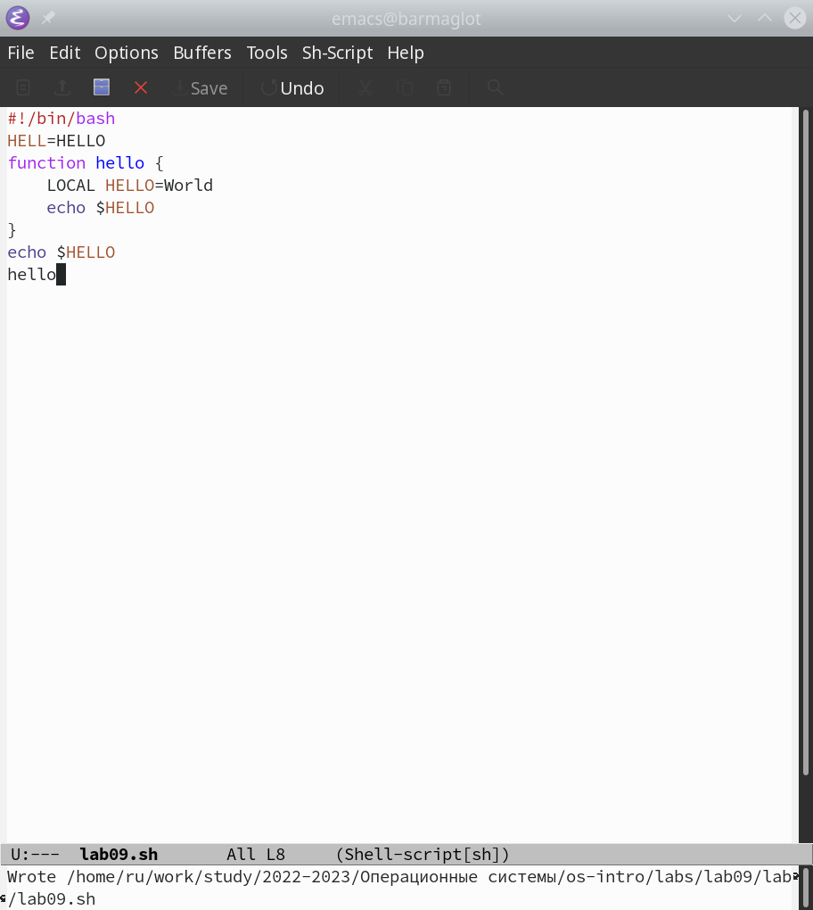
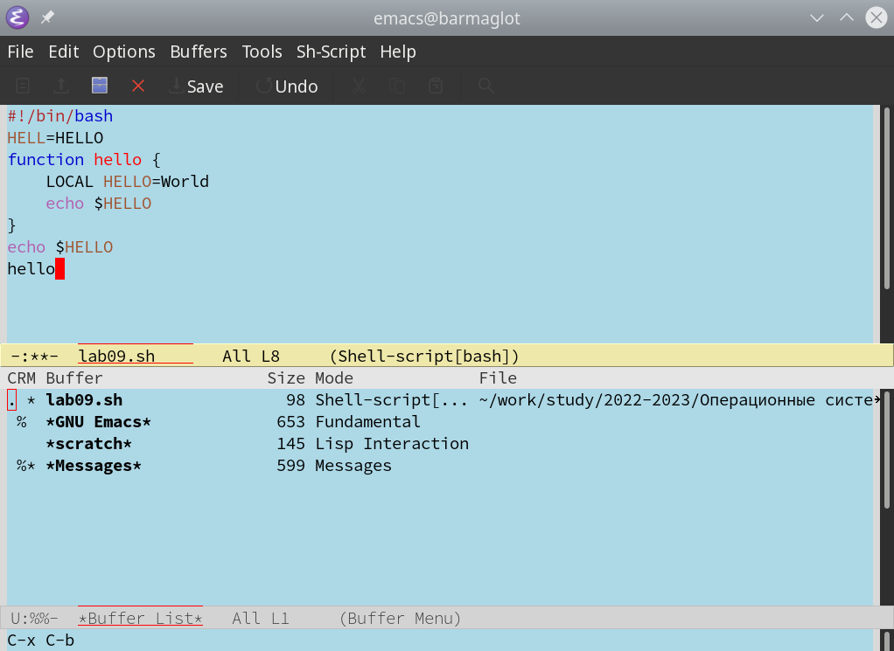
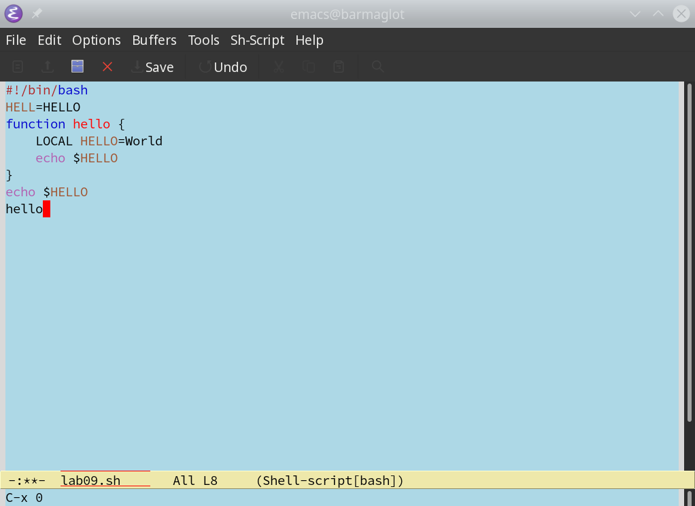
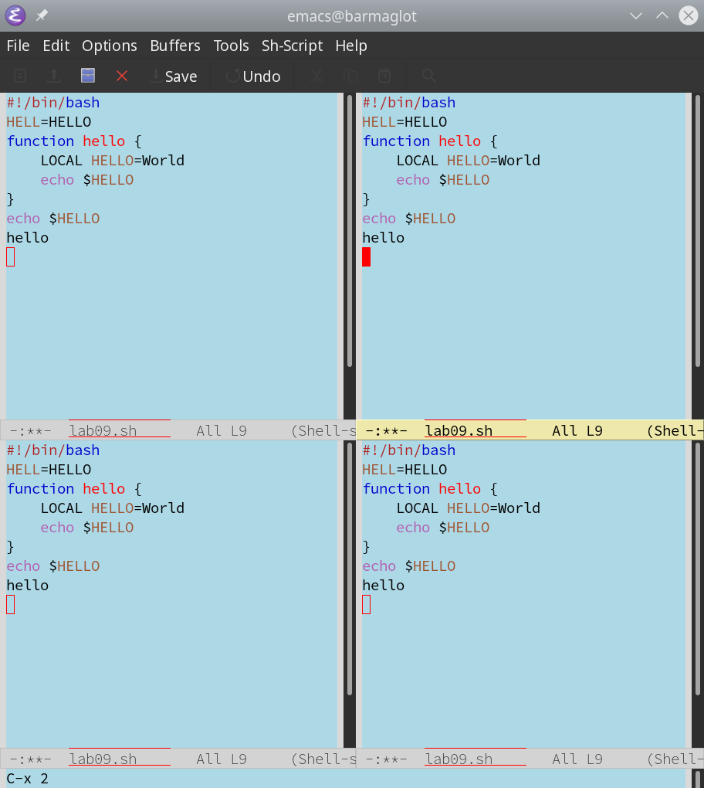
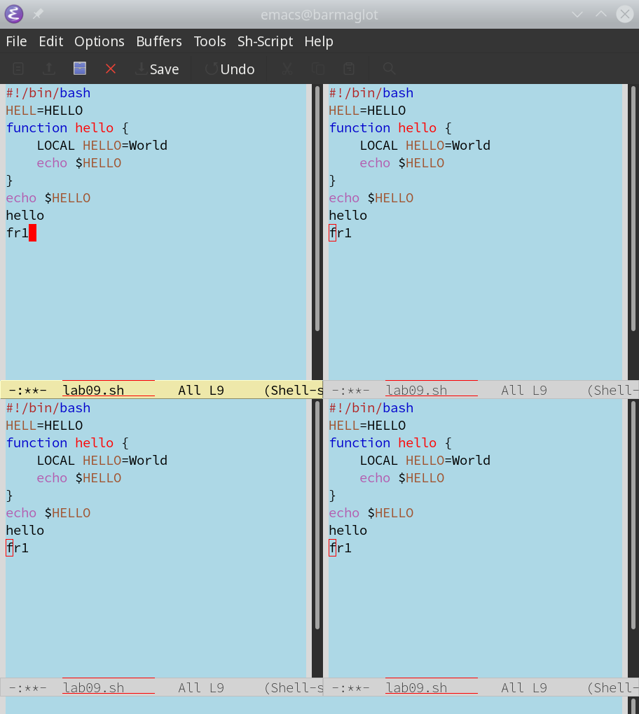
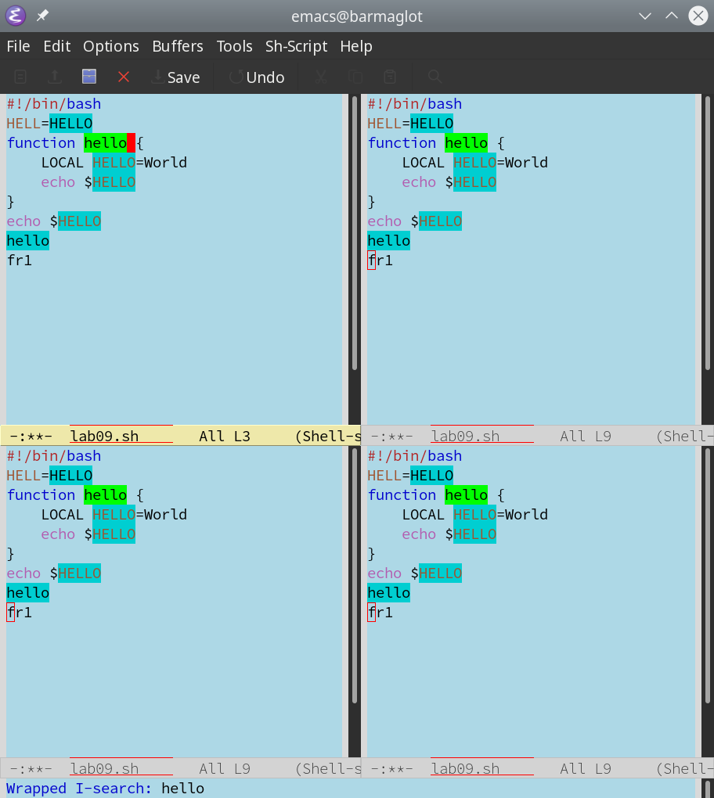

---
## Front matter
lang: ru-RU
title: Презентация по лабораторной работе №9
subtitle: Операционные системы
author:
  - Рыжкова У. В.
institute:
  - Российский университет дружбы народов, Москва, Россия
date: 08 апреля 2023

## i18n babel
babel-lang: russian
babel-otherlangs: english

 ## Fonts
sansfont: PT Sans

## Formatting pdf
toc: false
toc-title: Содержание
slide_level: 2
aspectratio: 169
section-titles: true
theme: metropolis
header-includes:
 - \metroset{progressbar=frametitle,sectionpage=progressbar,numbering=fraction}
 - '\makeatletter'
 - '\beamer@ignorenonframefalse'
 - '\makeatother'

---

## Докладчик

  * Рыжкова Ульяна Валерьевна
  * студент
  * Российский университет дружбы народов

## Выполнение
  
1. Открыла emacs, создала файл (с-x c-f) и ввела текст. Сохранила изменения (c-x c-s)

{#fig:001 width=100%}

## 

2. Провела с текстом различные манипуляции: вырезала строку (с-k), вставила её в конец файла (с-у), выделила область текста (с-space) и скопировала её в буфер (m-w); вырезала часть текста (с-w) и отменила последнее действие (с-/)

3. Освоила команды перемещения курсора: с-а, с-е, m-<, m->

## 

4. Вывела список активных буферов на экран с помощью комбинации c-x c-b и закрыла его, использовав комбинации с-х 0

{#fig:002 width=100%}

{#fig:003 width=100%}

## 

5. Поделила фрейм на 4 части: с-х 3 - поделила фрейм на два окна, с-х 2 - каждую часть поделила на 2 по горизонтали

{#fig:004 width=100%}

{#fig:005 width=100%}

## 

6. Переключилась в режим поиска (c-s), поискала слово 'hello' и переключалась между результатами с помощью той же комбинации. Вышла из режима поиска (с-g), перешла в режим поиска и замены (m-%). Для замены текста нажимаем '!'

{#fig:006 width=100%}

7. M-s o отличается от обычного режима тем, что результат отображается в отдельном окне

## Вывод

Я освоила базовый функционал текстового редактора emacs
