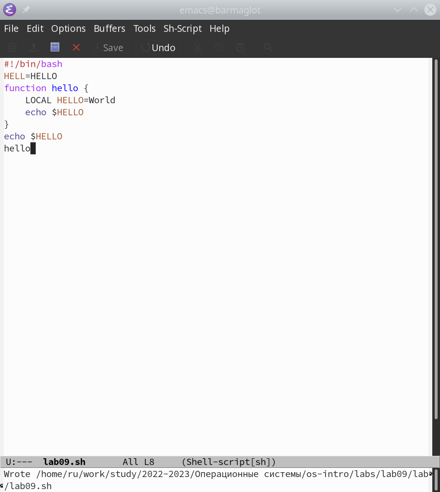
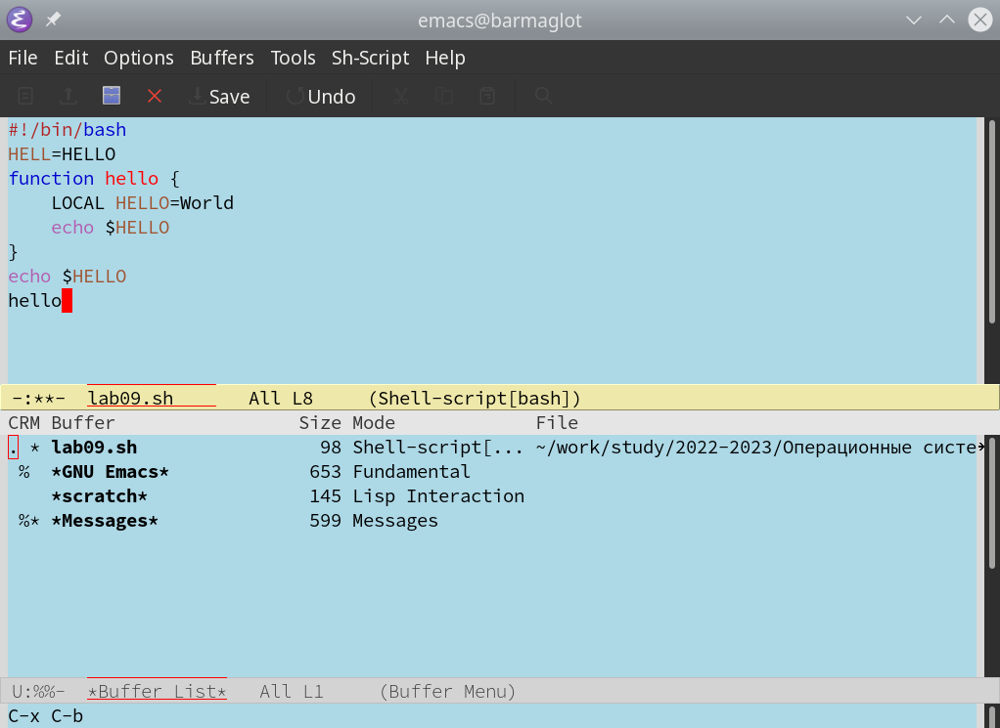
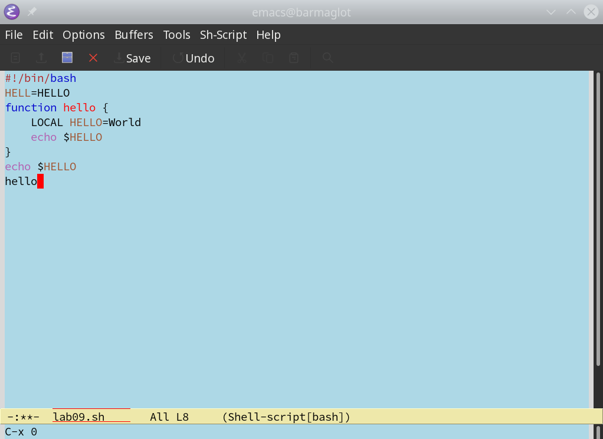
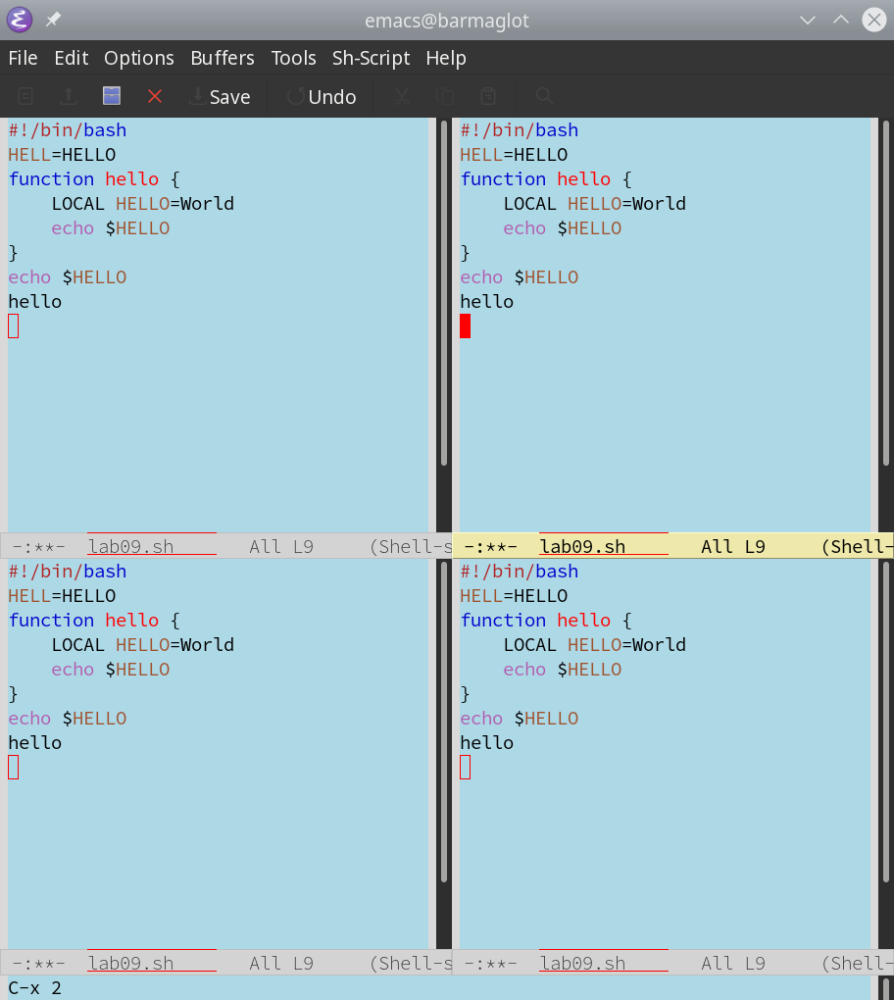
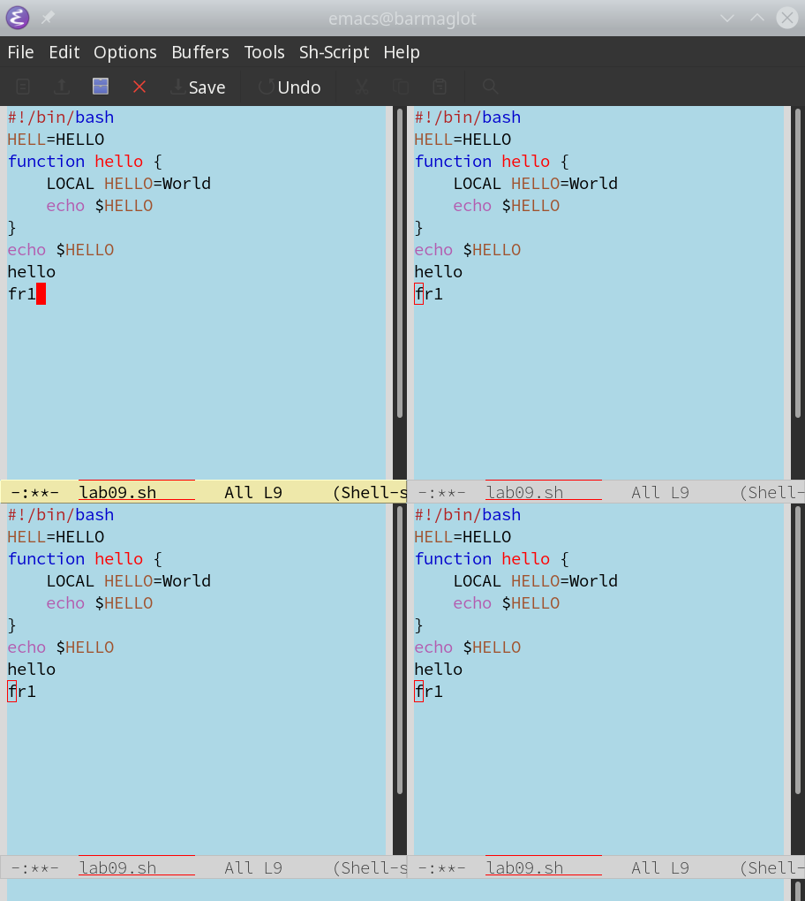
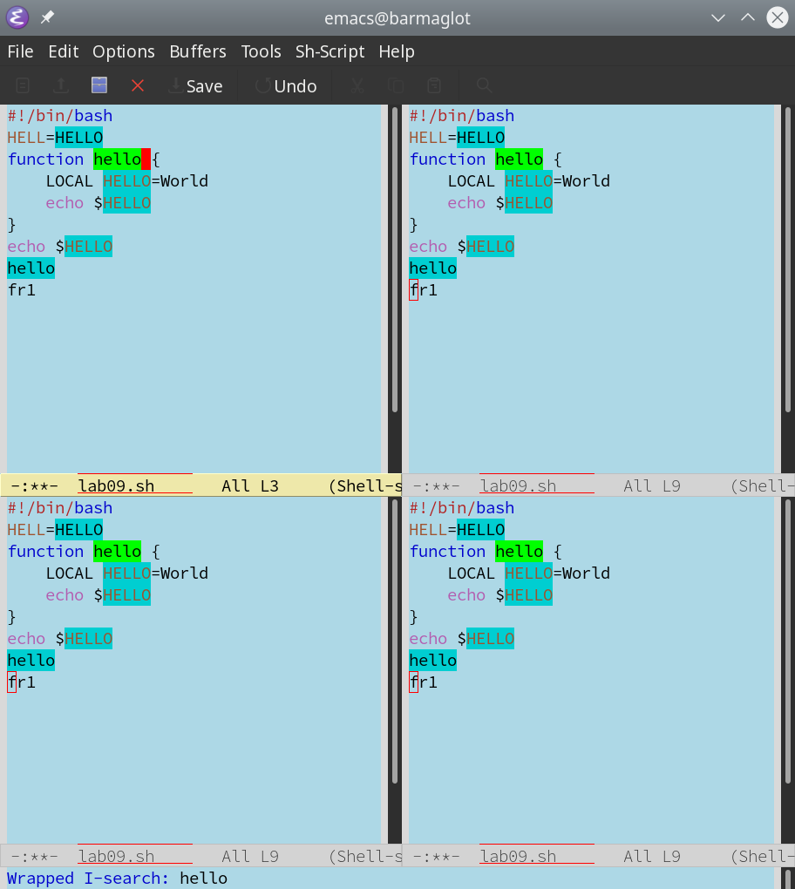

---
## Front matter
title: "Отчёт по лабораторной работе №9"
subtitle: "Дисциплина: Операционные системы"
author: "Рыжкова Ульяна Валерьевна"

## Generic otions
lang: ru-RU
toc-title: "Содержание"

## Bibliography
bibliography: bib/cite.bib
csl: pandoc/csl/gost-r-7-0-5-2008-numeric.csl

## Pdf output format
toc: true # Table of contents
toc-depth: 2
lof: true # List of figures
lot: true # List of tables
fontsize: 12pt
linestretch: 1.5
papersize: a4
documentclass: scrreprt
## I18n polyglossia
polyglossia-lang:
  name: russian
  options:
	- spelling=modern
	- babelshorthands=true
polyglossia-otherlangs:
  name: english
## I18n babel
babel-lang: russian
babel-otherlangs: english
## Fonts
mainfont: PT Serif
romanfont: PT Serif
sansfont: PT Sans
monofont: PT Mono
mainfontoptions: Ligatures=TeX
romanfontoptions: Ligatures=TeX
sansfontoptions: Ligatures=TeX,Scale=MatchLowercase
monofontoptions: Scale=MatchLowercase,Scale=0.9
## Biblatex
biblatex: true
biblio-style: "gost-numeric"
biblatexoptions:
  - parentracker=true
  - backend=biber
  - hyperref=auto
  - language=auto
  - autolang=other*
  - citestyle=gost-numeric
## Pandoc-crossref LaTeX customization
figureTitle: "Рис."
tableTitle: "Таблица"
listingTitle: "Листинг"
lofTitle: "Список иллюстраций"
lotTitle: "Список таблиц"
lolTitle: "Листинги"
## Misc options
indent: true
header-includes:
  - \usepackage{indentfirst}
  - \usepackage{float} # keep figures where there are in the text
  - \floatplacement{figure}{H} # keep figures where there are in the text
---

# Цель работы

Освоить текстовый редактор emacs

# Выполнение лабораторной работы

1. Открыла emacs, создала файл (с-x c-f) и ввела текст. Сохранила изменения (c-x c-s)

{#fig:001 width=100%}

2. Провела с текстом различные манипуляции: вырезала строку (с-k), вставила её в конец файла (с-у), выделила область текста (с-space) и скопировала её в буфер (m-w); вырезала часть текста (с-w) и отменила последнее действие (с-/)

3. Освоила команды перемещения курсора: с-а, с-е, m-<, m->

4. Вывела список активных буферов на экран с помощью комбинации c-x c-b и закрыла его, использовав комбинации с-х 0

{#fig:002 width=100%}

{#fig:003 width=100%}

5. Поделила фрейм на 4 части: с-х 3 - поделила фрейм на два окна, с-х 2 - каждую часть поделила на 2 по горизонтали

{#fig:004 width=100%}

{#fig:005 width=100%}

6. Переключилась в режим поиска (c-s), поискала слово 'hello' и переключалась между результатами с помощью той же комбинации. Вышла из режима поиска (с-g), перешла в режим поиска и замены (m-%). Для замены текста нажимаем '!'

{#fig:006 width=100%}

7. M-s o отличается от обычного режима тем, что результат отображается в отдельном окне

# Контрольные вопросы

1. Редактор emacs - экранный редактор текста, написанный на языке высокого уровня Elisp.

2. Многие операции в emacs удобнее производить с помощью клавиатуры, а не графического меню. Наиболее часто используются клавиши Ctrl и Meta. Так как не на всех клавиатурах есть клавиша Meta, вместо неё можно использовать Alt или Esc.

3. Буфер - файл, содержащий какой-либо текст. Окно - область, в которую выводится текст буфера.

4. В одном окне можно открыть более 10 буферов.

5. При запуске emacs открывается только один буфер с именем 'scratch'.

6. C-c | - одновременное нажатие 'ctrl' и 'с', а третья клавиша нажимается отдельно. С-с С-| - каждую пару нажимаем отдельно.

7. С-х 3 - разделить фрейм на два окна по вертикали, С-х 2 - по горизонтали.

8. Настройки emacs хранятся в файле .emacs в домашней директории пользователя.

9. Клавиша Backspace = C-k, но её можно переназначить.

10. Редактор vi мне понравился больше, так как он достаточно минималистичный более простой.

# Выводы

Я освоила базовый функционал текстового редактора emacs

