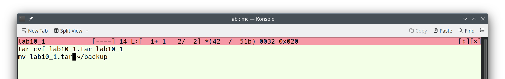
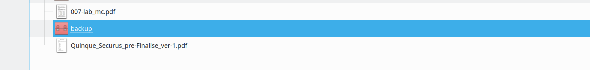
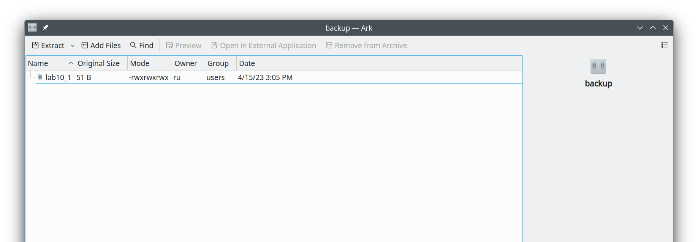
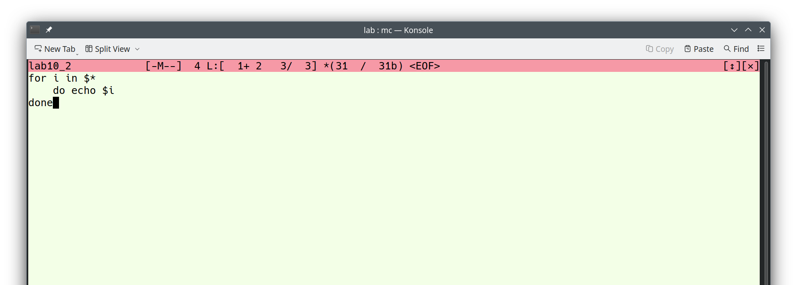
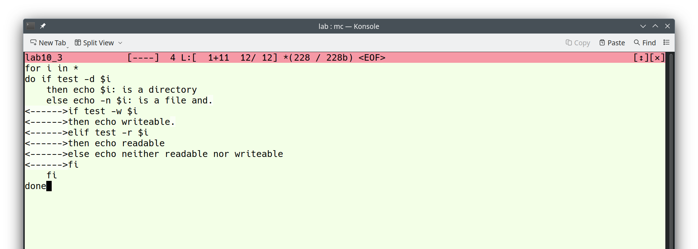
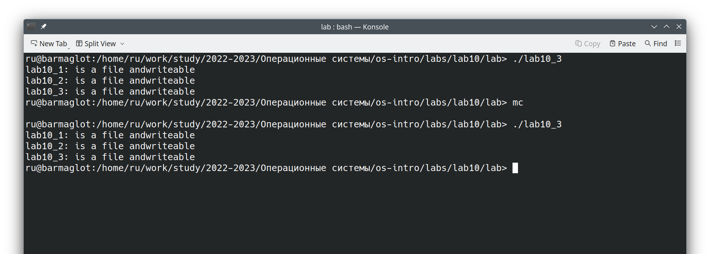
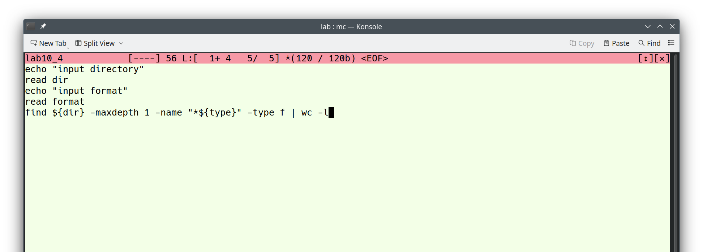
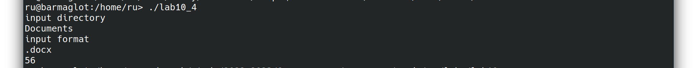

---
## Front matter
lang: ru-RU
title: Презентация по лабораторной работе №10
subtitle: "Дисциплина: Операционные системы"
author:
  - Рыжкова У. В.
institute:
  - Российский университет дружбы народов, Москва, Россия
date: 15 апреля 2023

## i18n babel
babel-lang: russian
babel-otherlangs: english

## Formatting pdf
toc: false
toc-title: Содержание
slide_level: 2
aspectratio: 169
section-titles: true
theme: metropolis
header-includes:
 - \metroset{progressbar=frametitle,sectionpage=progressbar,numbering=fraction}
 - '\makeatletter'
 - '\beamer@ignorenonframefalse'
 - '\makeatother'
---

## Докладчик

  * Рыжкова Ульяна Валерьевна
  * студент
  * Российский университет дружбы народов

## Выполнение 

1. Пишем скрипт, который архивирует сам себя и перемещает в директорию backup в домашнем каталоге

{#fig:001 width=100%}

## Выполнение

{#fig:002 width=100%}

{#fig:003 width=100%}

## Выполнение

2. Пишем скрипт, обрабатывающий произвольное число аргументов (в том числе превышающее 10)

{#fig:004 width=100%}

{#fig:005 width=100%}

## Выполнение

3. Пишем скрипт, являющийся аналогом команды ls

{#fig:006 width=100%}

{#fig:007 width=100%}

## Выполнение

4. Пишем скрипт, который вычисляет количество файлов заданного формата в указанной директории

{#fig:008 width=100%}

{#fig:009 width=100%}

## Выводы

Я ознакомилась с основами программирования в оболочке OC UNIX
