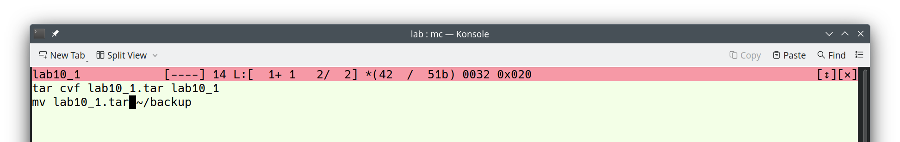
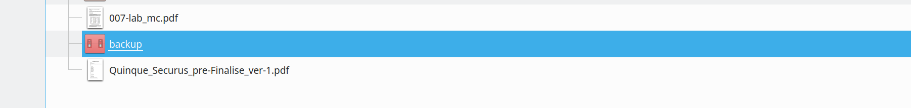
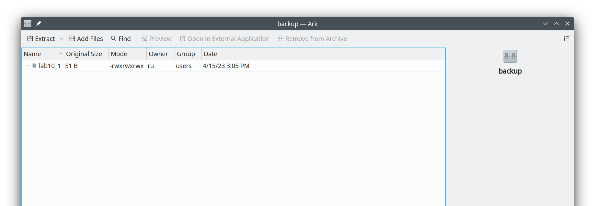
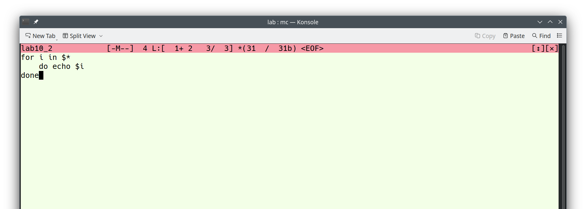
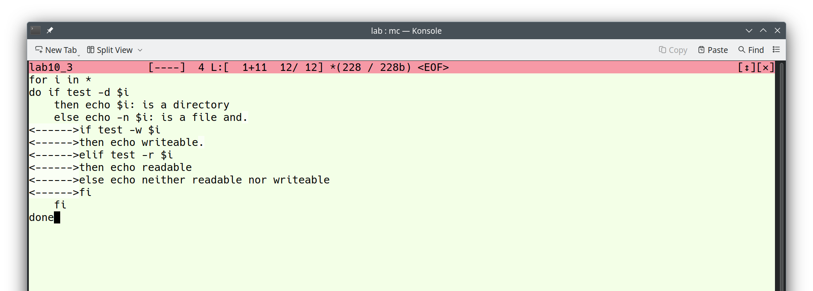
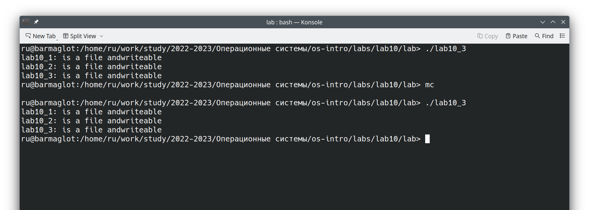
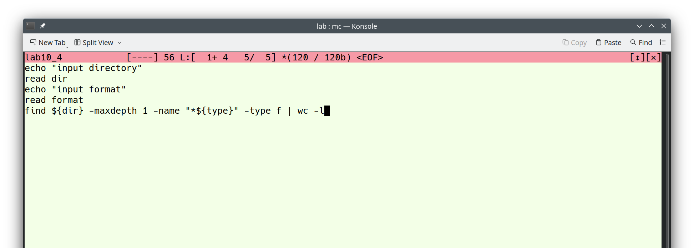
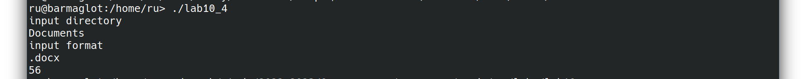

---
## Front matter
title: "Отчёт по лабораторной работе №10"
subtitle: "Дисциплина: Операционные системы"
author: "Рыжкова Ульяна Валерьевна"

## Generic otions
lang: ru-RU
toc-title: "Содержание"

## Bibliography
bibliography: bib/cite.bib
csl: pandoc/csl/gost-r-7-0-5-2008-numeric.csl

## Pdf output format
toc: true # Table of contents
toc-depth: 2
lof: true # List of figures
lot: true # List of tables
fontsize: 12pt
linestretch: 1.5
papersize: a4
documentclass: scrreprt
## I18n polyglossia
polyglossia-lang:
  name: russian
  options:
	- spelling=modern
	- babelshorthands=true
polyglossia-otherlangs:
  name: english
## I18n babel
babel-lang: russian
babel-otherlangs: english
## Fonts
mainfont: PT Serif
romanfont: PT Serif
sansfont: PT Sans
monofont: PT Mono
mainfontoptions: Ligatures=TeX
romanfontoptions: Ligatures=TeX
sansfontoptions: Ligatures=TeX,Scale=MatchLowercase
monofontoptions: Scale=MatchLowercase,Scale=0.9
## Biblatex
biblatex: true
biblio-style: "gost-numeric"
biblatexoptions:
  - parentracker=true
  - backend=biber
  - hyperref=auto
  - language=auto
  - autolang=other*
  - citestyle=gost-numeric
## Pandoc-crossref LaTeX customization
figureTitle: "Рис."
tableTitle: "Таблица"
listingTitle: "Листинг"
lofTitle: "Список иллюстраций"
lotTitle: "Список таблиц"
lolTitle: "Листинги"
## Misc options
indent: true
header-includes:
  - \usepackage{indentfirst}
  - \usepackage{float} # keep figures where there are in the text
  - \floatplacement{figure}{H} # keep figures where there are in the text
---

# Цель работы

Изучить основы программирования в оболочке OC UNIX. НАучиться писать небольшие командные файлы.

# Выполнение лабораторной работы

1. Пишем скрипт, который архивирует сам себя и перемещает в директорию backup в домашнем каталоге

{#fig:001 width=100%}

{#fig:002 width=100%}

{#fig:003 width=100%}

2. Пишем скрипт, обрабатывающий произвольное число аргументов (в том числе превышающее 10)

{#fig:004 width=100%}

{#fig:005 width=100%}

3. Пишем скрипт, являющийся аналогом команды ls

{#fig:006 width=100%}

{#fig:007 width=100%}

4. Пишем скрипт, который вычисляет количество файлов заданного формата в указанной директории

{#fig:008 width=100%}

{#fig:009 width=100%}

# Ответы на контрольные вопросы

1. Объясните понятие командной оболочки. Приведите примеры командных оболочек. Чем они отличаются?

*Командная оболочка* -  это программа, позволяющая пользователю взаимодействовать с операционной системой компьютера. В операционных системах типа UNIX/Linux наиболее часто используются следующие реализации командных оболочек:
  * *оболочка Борна (Bourne shell или sh)* — стандартная командная оболочка UNIX/Linux, содержащая базовый, но при этом полный набор функций;
  * *С-оболочка (или csh)* — надстройка на оболочкой Борна, использующая С-подобный синтаксис команд с возможностью сохранения истории выполнения команд;
  * *оболочка Корна (или ksh)* — напоминает оболочку С, но операторы управления программой совместимы с операторами оболочки Борна;
  * *BASH* — сокращение от Bourne Again Shell (опять оболочка Борна), в основе своей совмещает свойства оболочек С и Корна (разработка компании Free Software Foundation).

2. Что такое POSIX?

*POSIX (Portable Operating System Interface for Computer Environments)* — набор стандартов описания интерфейсов взаимодействия операционной системы и прикладных программ.

3. Как определяются переменные и массивы в языке программирования bash?

Команда mark=/usr/andy/bin присваивает значение строки символов /usr/andy/bin переменной mark типа строка символов, массивы задают командой set с флагом -А.

4. Каково назначение операторов let и read?

Команда let берет два операнда и присваивает их переменной, а команда read позволяет читать значения переменных со стандартного ввода.

5. Какие арифметические операции можно применять в языке программирования bash?

C помощью команды let можно производить базовые арифметические операции: сложение/вычитание, умножение/деление, логические операции.

6. Что означает операция (( ))?

В двойные скобки можно записывать выражения для вычисления.

7. Какие стандартные имена переменных Вам известны?

PATH, HOME, IFS, MAIL, TERM, LOGNAME. Остальные переменные можно посмотреть с помощью команды set

8. Что такое метасимволы?

Такие символы, как ' < > * ? | \ " &, являются метасимволами и имеют для командного процессора специальный смысл.

9. Как экранировать метасимволы?

Экранирование может быть осуществлено с помощью предшествующего метасимволу символа \, который, в свою очередь, является метасимволом.

10. Как создавать и запускать командные файлы?

Создаём файлы командой touch (как и любые другие), запускаем как исполняемые (с комбинацией ./имя_файла), предварительно сделав их исполняемыми

11. Как определяются функции в языке программирования bash?

Существует ключевое слово function, после которого следует имя функции и список команд, заключённых в фигурные скобки. Удалить функцию можно с помощью команды unset c флагом -f.

12. Каким образом можно выяснить, является файл каталогом или обычным файлом?

test -d FILE - истина, если FILE является каталогом. test -e FILE - истина, если FILE является файлом.

13. Каково назначение команд set, typeset и unset?
  * команда set - вывод списка переменных окружения
  * команда unset - удаление переменной из окружения командной оболочки

Команда typeset имеет четыре опции для работы с функциями:
  * -f — перечисляет определённые на текущий момент функции;
  * -ft — при последующем вызове функции инициирует её трассировку;
  * -fx — экспортирует все перечисленные функции в любые дочерние программы оболочек;
  * -fu — обозначает указанные функции как автоматически загружаемые. Автоматически загружаемые функции хранятся в командных файлах, а при их вызове оболочка просматривает переменную FPATH, отыскивая файл с одноимёнными именами функций, загружает его и вызывает эти функции.

14. Как передаются параметры в командные файлы?

При вызове командного файла на выполнение параметры ему могут быть переданы точно таким же образом, как и выполняемой программе. С точки зрения командного
файла эти параметры являются позиционными. Символ $ является метасимволом командного процессора. Он используется, в частности, для ссылки на параметры, точнее,
для получения их значений в командном файле. В командный файл можно передать до девяти параметров. При использовании где-либо в командном файле комбинации
символов $i, где 0 < 𝑖 < 10, вместо неё будет осуществлена подстановка значения параметра с порядковым номером i, т.е. аргумента командного файла с порядковым
номером i. Использование комбинации символов $0 приводит к подстановке вместо неё имени данного командного файла.

15. Назовите специальные переменные языка bash и их назначение

OPTARG и OPTIND. Если ожидается дополнительное значение, то OPTARG устанавливается в значение этого аргумента (будет равна file_in.txt для опции i и file_out.doc для опции o. OPTIND является числовым индексом на упомянутый аргумент.

# Выводы

Я освоила базовые команды для программирования в оболочке ОС UNIX

