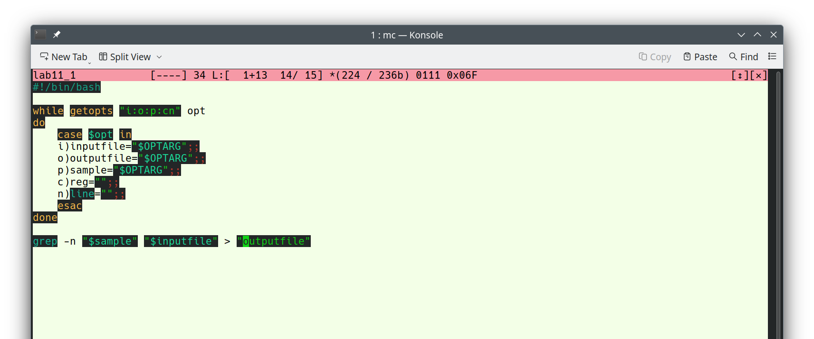
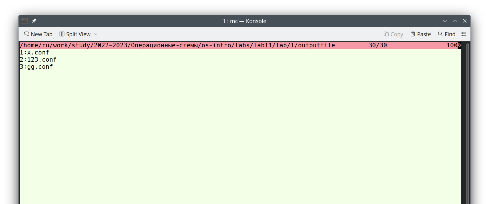
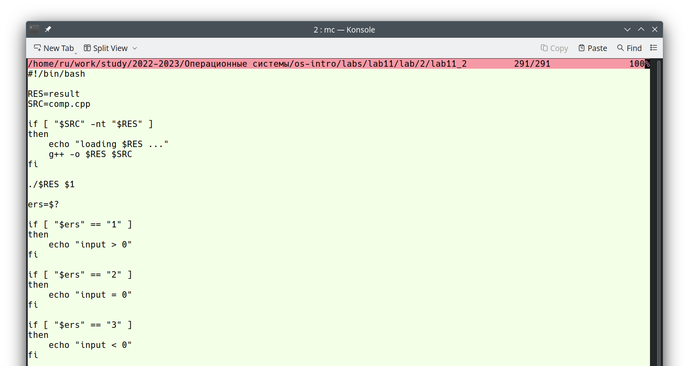
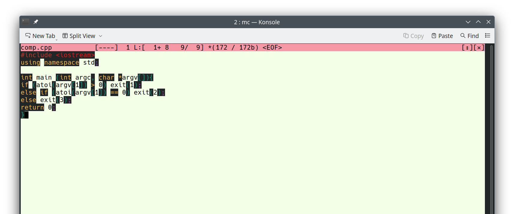
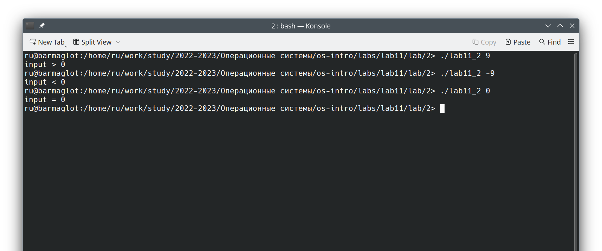
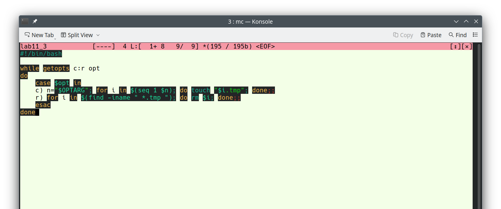
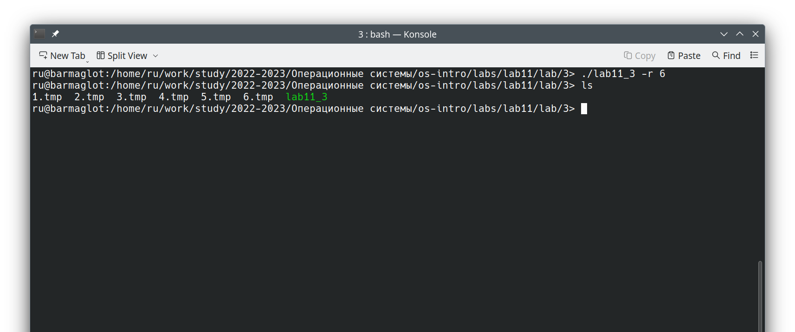
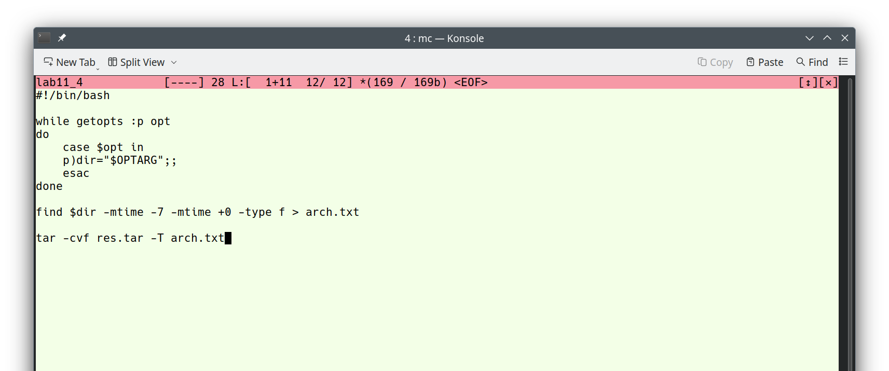
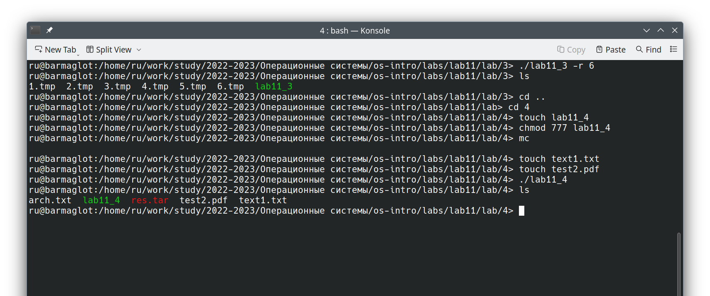

---
## Front matter
lang: ru-RU
title: Презентация по лабораторной работе №11
subtitle: Операционные системы
author:
  - Рыжкова У. В.
institute:
  - Российский университет дружбы народов, Москва, Россия
date: 22 апреля 2023

## i18n babel
babel-lang: russian
babel-otherlangs: english

## Formatting pdf
toc: false
toc-title: Содержание
slide_level: 2
aspectratio: 169
section-titles: true
theme: metropolis
header-includes:
 - \metroset{progressbar=frametitle,sectionpage=progressbar,numbering=fraction}
 - '\makeatletter'
 - '\beamer@ignorenonframefalse'
 - '\makeatother'
---

## Докладчик

  * Рыжкова Ульяна Валерьевна
  * студент
  * Российский университет дружбы народов

## Цель работы

Изучить основы программирования в оболочке ОС UNIX. Научится писать более сложные командные файлы с использованием логических управляющих конструкций и циклов.

## Выполнение лабораторной работы

1. Первое задание: написать программу, которая анализирует командную строку и ищет нужные строки

{#fig:001 width=100%}

{#fig:002 width=100%}

## 

2. Второе задание: написать две программы. Одна анализирует число, а вторая по результататм работы первой выводит сообщение о введенном числе

{#fig:003 width=100%}

{#fig:004 width=100%}

## 

{#fig:005 width=100%}

## 

3. Третье задание: написать программу, которая создаёт и удаляет (при их существовании) указанное число файлов

{#fig:006 width=100%}

{#fig:007 width=100%}

## 

4. Четвертое задание: написать программу, которая запаковывает в tar архив только те файлы, которые были изменены в течение последней недели

{#fig:008 width=100%}

{#fig:009 width=100%}

## Выводы

Я продолжаю познавать основы программирования в оболочке ОС UNIX
