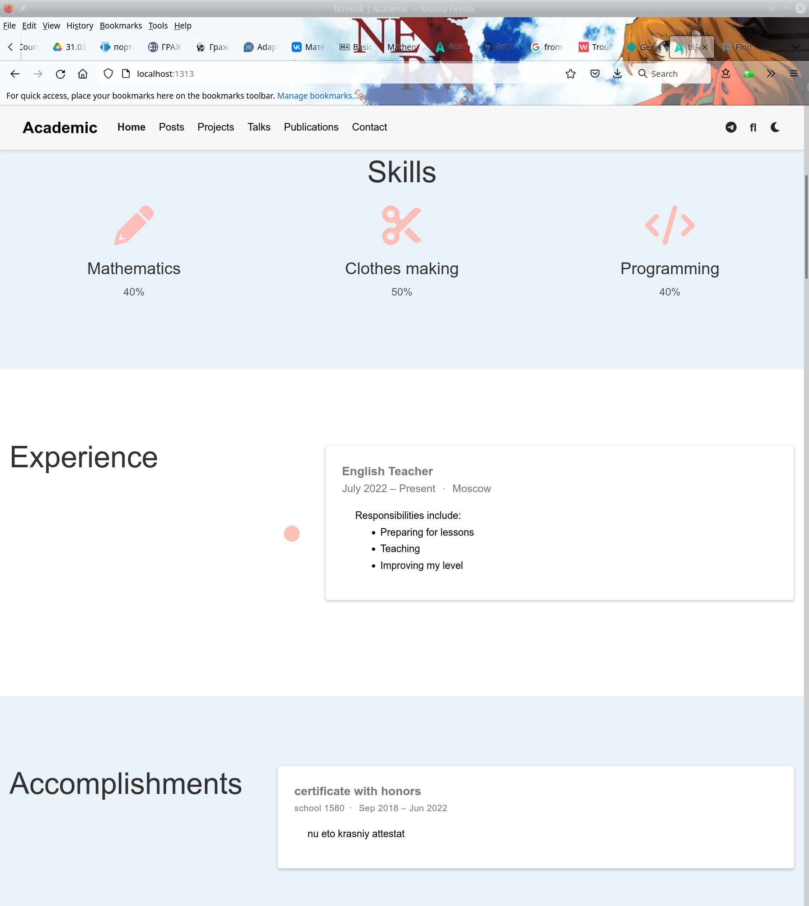

---
## Front matter
lang: ru-RU
title: Презентация по выполнению индивидуального проекта
subtitle: 3 этап
author:
  - Рыжкова У. В.
institute:
  - Российский университет дружбы народов, Москва, Россия
date: 06 апреля 2023

## i18n babel
babel-lang: russian
babel-otherlangs: english

 ## Fonts
sansfont: PT Sans

## Formatting pdf
toc: false
toc-title: Содержание
slide_level: 2
aspectratio: 169
section-titles: true
theme: metropolis
header-includes:
 - \metroset{progressbar=frametitle,sectionpage=progressbar,numbering=fraction}
 - '\makeatletter'
 - '\beamer@ignorenonframefalse'
 - '\makeatother'

---

## Докладчик

  * Рыжкова Ульяна Валерьевна
  * студент
  * Российский университет дружбы народов

## Выполнение 

1. Добавлена информация о навыках, опыте и достижениях. 

2. Написаны посты по прошедшей неделе и на тему по выбору (язык разметки LaTeX).

{#fig:001 width=100%}

## Выводы

Третий этап выполнен.
